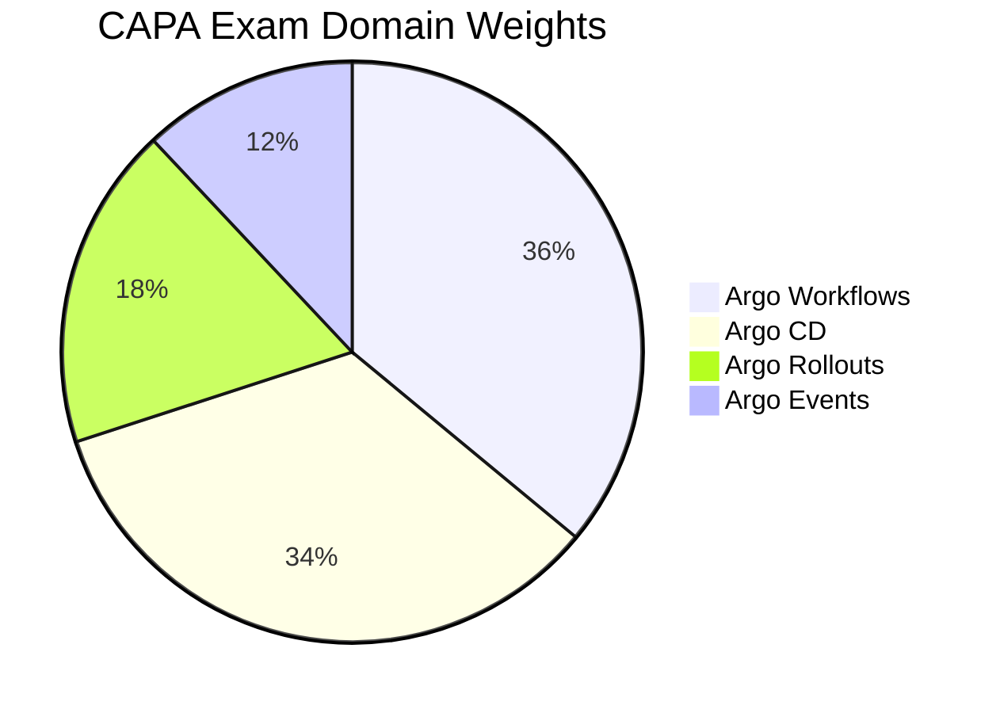

# CAPA - Certified Argo Project Associate

The **Certified Argo Project Associate (CAPA)** certification validates foundational knowledge of the Argo Project ecosystem, including Argo Workflows, Argo CD, Argo Rollouts, and Argo Events for GitOps and progressive delivery.

## Exam Details

| Detail | Value |
|---|---|
| **Format** | Multiple Choice |
| **Duration** | 90 minutes |
| **Questions** | 60 |
| **Passing Score** | 75% |
| **Cost** | $250 |
| **Validity** | 2 years |
| **Prerequisites** | None |
| **Delivery** | Online proctored (PSI Secure Browser) |

## Domain Breakdown

| Domain | Weight |
|---|---|
| Argo Workflows | 36% |
| Argo CD | 34% |
| Argo Rollouts | 18% |
| Argo Events | 12% |
| **Total** | **100%** |

!!! tip "Exam Tip"
    Argo Workflows (36%) and Argo CD (34%) together account for 70% of the exam. Focus heavily on workflow templates, DAGs, artifacts for Workflows, and GitOps fundamentals, sync strategies, Helm/Kustomize integration for Argo CD.

## Study Progress

- [ ] Argo Workflows (36%)
- [ ] Argo CD (34%)
- [ ] Argo Rollouts (18%)
- [ ] Argo Events (12%)
- [ ] Practice questions and mock exams
- [ ] Final review and weak-area revision

## Key Resources

### Official Resources

| Resource | Description |
|---|---|
| [CAPA Curriculum (PDF)](https://github.com/cncf/curriculum) | Official exam curriculum maintained by CNCF |
| [CAPA Certification Page](https://training.linuxfoundation.org/certification/certified-argo-project-associate-capa/) | Registration, handbook, and exam policies |
| [Argo Workflows Docs](https://argo-workflows.readthedocs.io/) | Official Argo Workflows documentation |
| [Argo CD Docs](https://argo-cd.readthedocs.io/) | Official Argo CD documentation |
| [Argo Rollouts Docs](https://argo-rollouts.readthedocs.io/) | Official Argo Rollouts documentation |

### Courses

| Course | Platform |
|---|---|
| Certified Argo Project Associate (CAPA) | KodeKloud |
| Argo CD Fundamentals | Codefresh / Akuity |

### Community Resources

| Resource | Description |
|---|---|
| [CNCF Blog — How to Ace CAPA](https://www.cncf.io/blog/2024/10/18/how-to-ace-the-certified-argo-project-associate-capa-exam/) | Tips from CNCF |
| [Argo Project GitHub](https://github.com/argoproj) | Official Argo repositories |
