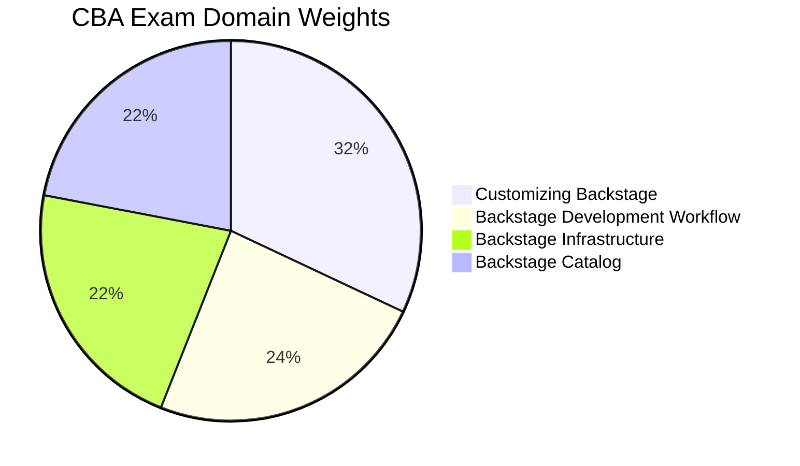

# CBA - Certified Backstage Associate

The **Certified Backstage Associate (CBA)** certification validates foundational knowledge of Backstage, the open-source developer portal platform originally created by Spotify. It covers customization, development workflows, infrastructure, and the software catalog.

## Exam Details

| Detail | Value |
|---|---|
| **Format** | Multiple Choice |
| **Duration** | 90 minutes |
| **Questions** | 60 |
| **Passing Score** | 75% |
| **Cost** | $250 |
| **Validity** | 2 years |
| **Prerequisites** | None |
| **Delivery** | Online proctored (PSI Secure Browser) |

## Domain Breakdown

| Domain | Weight |
|---|---|
| Customizing Backstage | 32% |
| Backstage Development Workflow | 24% |
| Backstage Infrastructure | 22% |
| Backstage Catalog | 22% |
| **Total** | **100%** |

!!! tip "Exam Tip"
    Customizing Backstage (32%) is the largest domain. Understand the difference between frontend and backend plugins, React/Material UI components, and how to extend Backstage functionality. Combined with Development Workflow (24%), these two domains account for 56% of the exam.

## Study Progress

- [ ] Customizing Backstage (32%)
- [ ] Backstage Development Workflow (24%)
- [ ] Backstage Infrastructure (22%)
- [ ] Backstage Catalog (22%)
- [ ] Practice questions and mock exams
- [ ] Final review and weak-area revision

## Key Resources

### Official Resources

| Resource | Description |
|---|---|
| [CBA Curriculum (PDF)](https://github.com/cncf/curriculum) | Official exam curriculum maintained by CNCF |
| [CBA Certification Page](https://training.linuxfoundation.org/certification/certified-backstage-associate-cba/) | Registration, handbook, and exam policies |
| [Backstage Documentation](https://backstage.io/docs/) | Official Backstage docs |
| [Backstage GitHub](https://github.com/backstage/backstage) | Official Backstage repository |

### Courses

| Course | Platform |
|---|---|
| Certified Backstage Associate (CBA) | KodeKloud |
| Backstage 101: Building Internal Developer Portals | TeKanAid |

### Community Resources

| Resource | Description |
|---|---|
| [Spotify Engineering — CBA Tips](https://engineering.atspotify.com/2025/3/certified-backstage-associate-exam-tips) | Tips from Backstage creators |
| [Backstage Community](https://backstage.io/community/) | Official community resources |
