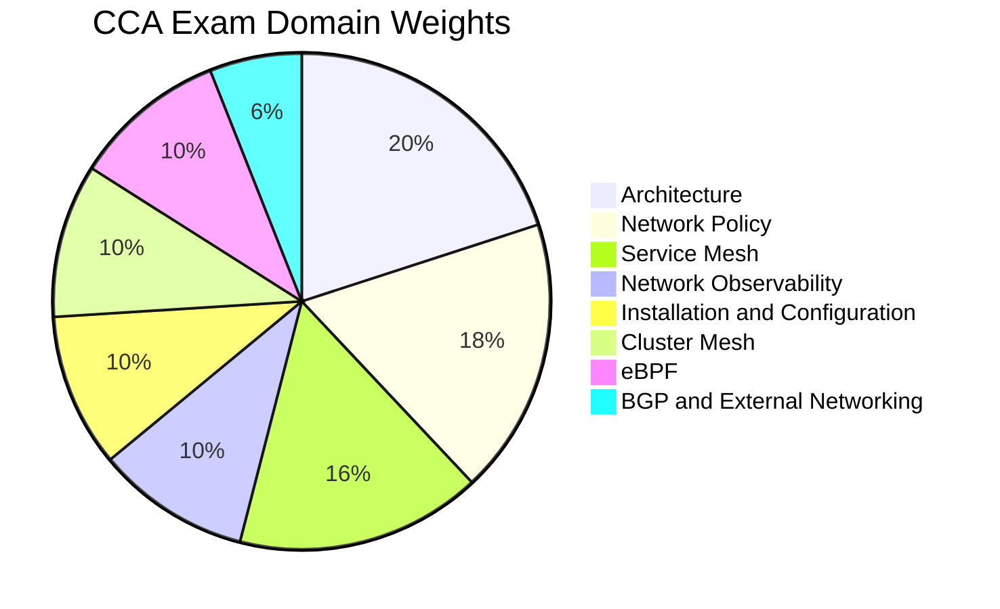

# CCA - Cilium Certified Associate

The **Cilium Certified Associate (CCA)** certification validates foundational knowledge of Cilium, eBPF-based networking, network policy, service mesh, observability, and cluster mesh in Kubernetes environments.

## Exam Details

| Detail | Value |
|---|---|
| **Format** | Multiple Choice |
| **Duration** | 90 minutes |
| **Questions** | 60 |
| **Passing Score** | 75% |
| **Cost** | $250 |
| **Validity** | 2 years |
| **Prerequisites** | None |
| **Delivery** | Online proctored (PSI Secure Browser) |

## Domain Breakdown

| Domain | Weight |
|---|---|
| Architecture | 20% |
| Network Policy | 18% |
| Service Mesh | 16% |
| Network Observability | 10% |
| Installation and Configuration | 10% |
| Cluster Mesh | 10% |
| eBPF | 10% |
| BGP and External Networking | 6% |
| **Total** | **100%** |

!!! tip "Exam Tip"
    Architecture (20%) and Network Policy (18%) together account for 38% of the exam. Understand Cilium's architecture, IPAM, datapath models, and identity-based network security model. The exam covers 8 domains — the broadest of any associate cert.

## Key Resources

### Official Resources

| Resource | Description |
|---|---|
| [CCA Curriculum (PDF)](https://github.com/cncf/curriculum) | Official exam curriculum maintained by CNCF |
| [CCA Certification Page](https://training.linuxfoundation.org/certification/cilium-certified-associate-cca/) | Registration, handbook, and exam policies |
| [Cilium Documentation](https://docs.cilium.io/) | Official Cilium docs |
| [Hubble Documentation](https://docs.cilium.io/en/stable/gettingstarted/hubble/) | Cilium observability layer |

### Courses

| Course | Platform |
|---|---|
| Cilium Certified Associate (CCA) | KodeKloud |
| Getting Started with Cilium | Isovalent Academy |

### Community Resources

| Resource | Description |
|---|---|
| [Isovalent CCA Study Guide](https://github.com/isovalent/CCA-Study-Guide) | Official Isovalent study guide |
| [Cilium Interactive Labs](https://isovalent.com/labs/) | Hands-on Cilium labs |
