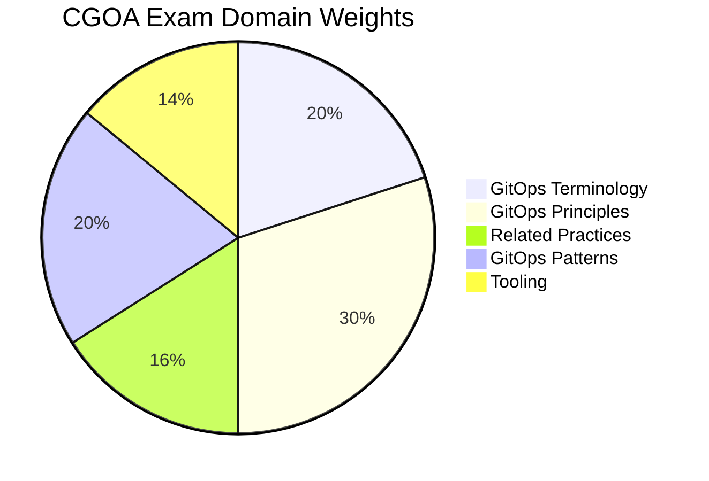

# CGOA - Certified GitOps Associate

The **Certified GitOps Associate (CGOA)** certification validates understanding of GitOps principles, terminology, and best practices for managing software systems using Git as the single source of truth.

## Exam Details

| Detail | Value |
|---|---|
| **Format** | Multiple Choice |
| **Duration** | 90 minutes |
| **Questions** | 60 |
| **Passing Score** | 75% |
| **Cost** | $250 |
| **Validity** | 2 years |
| **Prerequisites** | None |
| **Delivery** | Online proctored (PSI Secure Browser) |

## Domain Breakdown

| Domain | Weight |
|---|---|
| GitOps Terminology | 20% |
| GitOps Principles | 30% |
| Related Practices | 16% |
| GitOps Patterns | 20% |
| Tooling | 14% |
| **Total** | **100%** |

!!! tip "Exam Tip"
    GitOps Principles (30%) is the largest domain. Know the four OpenGitOps principles: Declarative, Versioned and Immutable, Pulled Automatically, and Continuously Reconciled. Combined with GitOps Terminology (20%), half the exam is about core concepts.

## Key Resources

### Official Resources

| Resource | Description |
|---|---|
| [CGOA Curriculum (PDF)](https://github.com/cncf/curriculum) | Official exam curriculum maintained by CNCF |
| [CGOA Certification Page](https://training.linuxfoundation.org/certification/certified-gitops-associate-cgoa/) | Registration, handbook, and exam policies |
| [OpenGitOps](https://opengitops.dev/) | Official GitOps principles and standards |

### Courses

| Course | Platform |
|---|---|
| Introduction to GitOps (LFS169) | Linux Foundation (free) |
| Certified GitOps Associate (CGOA) | KodeKloud |

### Community Resources

| Resource | Description |
|---|---|
| [CGOA Study Guide](https://github.com/otkd/CGOA-Study-Guide) | Community study guide on GitHub |
| [CNCF Blog — How to Ace CGOA](https://www.cncf.io/blog/2024/10/30/how-to-ace-the-certified-gitops-associate-cgoa-exam/) | Tips from CNCF |
