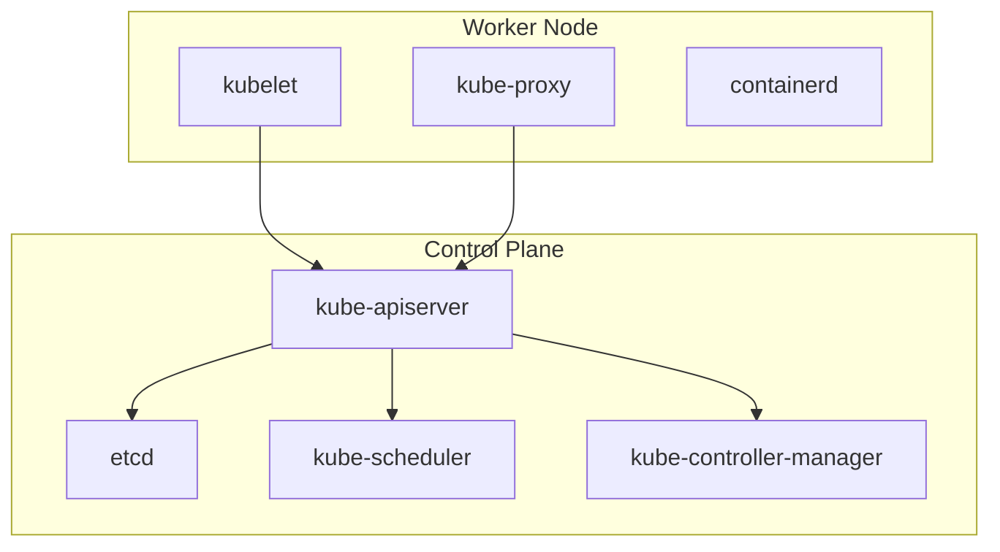

# Cluster Architecture, Installation & Configuration (25%)

This domain covers the foundational skills of setting up, configuring, and maintaining Kubernetes clusters. You need to be comfortable with `kubeadm` for cluster lifecycle management, understand RBAC for access control, manage etcd backups, and work with TLS certificates. This is the second-largest domain on the CKA exam.

## Key Concepts

### Cluster Architecture Overview

A Kubernetes cluster consists of control plane nodes and worker nodes:

- **Control Plane Components**: `kube-apiserver`, `etcd`, `kube-scheduler`, `kube-controller-manager`, `cloud-controller-manager`
- **Worker Node Components**: `kubelet`, `kube-proxy`, container runtime (containerd)
- **Add-ons**: CoreDNS, CNI plugin, metrics-server



### Kubeadm Cluster Setup

`kubeadm` is the standard tool for bootstrapping Kubernetes clusters.

#### Initialize a Control Plane Node

```bash
# Initialize the cluster with a pod network CIDR
sudo kubeadm init --pod-network-cidr=10.244.0.0/16 --apiserver-advertise-address=<CONTROL_PLANE_IP>

# Set up kubeconfig for the current user
mkdir -p $HOME/.kube
sudo cp -i /etc/kubernetes/admin.conf $HOME/.kube/config
sudo chown $(id -u):$(id -g) $HOME/.kube/config

# Install a CNI plugin (e.g., Flannel)
kubectl apply -f https://github.com/flannel-io/flannel/releases/latest/download/kube-flannel.yml
```

#### Join Worker Nodes

```bash
# On the control plane, generate the join command
kubeadm token create --print-join-command

# On the worker node, run the output from above
sudo kubeadm join <CONTROL_PLANE_IP>:6443 --token <token> --discovery-token-ca-cert-hash sha256:<hash>
```

!!! tip "Exam Tip"
    If the join token has expired, you can regenerate one with `kubeadm token create --print-join-command`. Tokens expire after 24 hours by default.

### Cluster Upgrades with kubeadm

Cluster upgrades must be done in order: control plane first, then worker nodes.

#### Upgrade Control Plane

```bash
# Check available versions
sudo apt-cache madison kubeadm

# Upgrade kubeadm
sudo apt-mark unhold kubeadm
sudo apt-get update && sudo apt-get install -y kubeadm=1.31.0-1.1
sudo apt-mark hold kubeadm

# Verify the upgrade plan
sudo kubeadm upgrade plan

# Apply the upgrade
sudo kubeadm upgrade apply v1.31.0

# Upgrade kubelet and kubectl
sudo apt-mark unhold kubelet kubectl
sudo apt-get install -y kubelet=1.31.0-1.1 kubectl=1.31.0-1.1
sudo apt-mark hold kubelet kubectl

# Restart kubelet
sudo systemctl daemon-reload
sudo systemctl restart kubelet
```

#### Upgrade Worker Nodes

```bash
# On the control plane: drain the worker node
kubectl drain <node-name> --ignore-daemonsets --delete-emptydir-data

# On the worker node: upgrade kubeadm
sudo apt-mark unhold kubeadm
sudo apt-get update && sudo apt-get install -y kubeadm=1.31.0-1.1
sudo apt-mark hold kubeadm

# Upgrade the node configuration
sudo kubeadm upgrade node

# Upgrade kubelet and kubectl
sudo apt-mark unhold kubelet kubectl
sudo apt-get install -y kubelet=1.31.0-1.1 kubectl=1.31.0-1.1
sudo apt-mark hold kubelet kubectl

# Restart kubelet
sudo systemctl daemon-reload
sudo systemctl restart kubelet

# On the control plane: uncordon the worker node
kubectl uncordon <node-name>
```

!!! tip "Exam Tip"
    Always drain a node before upgrading it. Remember the sequence: upgrade kubeadm, then run `kubeadm upgrade`, then upgrade kubelet and kubectl. The control plane must be upgraded before worker nodes.

### etcd Backup and Restore

etcd stores all cluster state. Backing up and restoring etcd is a critical CKA skill.

#### Backup etcd

```bash
# Find the etcd pod's configuration to get certificate paths
kubectl -n kube-system describe pod etcd-controlplane | grep -A 5 "Command"

# Create a snapshot backup
ETCDCTL_API=3 etcdctl snapshot save /opt/etcd-backup.db \
  --endpoints=https://127.0.0.1:2379 \
  --cacert=/etc/kubernetes/pki/etcd/ca.crt \
  --cert=/etc/kubernetes/pki/etcd/server.crt \
  --key=/etc/kubernetes/pki/etcd/server.key

# Verify the backup
ETCDCTL_API=3 etcdctl snapshot status /opt/etcd-backup.db --write-table
```

#### Restore etcd

```bash
# Restore from snapshot to a new data directory
ETCDCTL_API=3 etcdctl snapshot restore /opt/etcd-backup.db \
  --data-dir=/var/lib/etcd-from-backup

# Update the etcd pod manifest to use the new data directory
# Edit /etc/kubernetes/manifests/etcd.yaml
# Change the hostPath volume from /var/lib/etcd to /var/lib/etcd-from-backup
```

```yaml
# In /etc/kubernetes/manifests/etcd.yaml, update the volume:
volumes:
- hostPath:
    path: /var/lib/etcd-from-backup
    type: DirectoryOrCreate
  name: etcd-data
```

!!! tip "Exam Tip"
    The etcd certificate paths are found in the etcd static pod manifest at `/etc/kubernetes/manifests/etcd.yaml`. You do not need to memorize them -- just look them up. The `--data-dir` for restore must be a **new** directory, not the existing one.

### RBAC Configuration

Role-Based Access Control (RBAC) controls who can do what in the cluster.

#### RBAC Components

- **Role** / **ClusterRole**: Defines a set of permissions (verbs on resources)
- **RoleBinding** / **ClusterRoleBinding**: Binds a Role/ClusterRole to users, groups, or ServiceAccounts

=== "Imperative"

    ```bash
    # Create a Role
    kubectl create role pod-reader \
      --verb=get,list,watch \
      --resource=pods \
      -n development

    # Create a RoleBinding
    kubectl create rolebinding pod-reader-binding \
      --role=pod-reader \
      --user=jane \
      -n development

    # Create a ClusterRole
    kubectl create clusterrole node-reader \
      --verb=get,list,watch \
      --resource=nodes

    # Create a ClusterRoleBinding
    kubectl create clusterrolebinding node-reader-binding \
      --clusterrole=node-reader \
      --user=jane

    # Check permissions
    kubectl auth can-i list pods --as jane -n development
    kubectl auth can-i list nodes --as jane
    ```

=== "Declarative"

    ```yaml
    # role.yaml
    apiVersion: rbac.authorization.k8s.io/v1
    kind: Role
    metadata:
      name: pod-reader
      namespace: development
    rules:
    - apiGroups: [""]
      resources: ["pods"]
      verbs: ["get", "list", "watch"]
    ---
    # rolebinding.yaml
    apiVersion: rbac.authorization.k8s.io/v1
    kind: RoleBinding
    metadata:
      name: pod-reader-binding
      namespace: development
    subjects:
    - kind: User
      name: jane
      apiGroup: rbac.authorization.k8s.io
    roleRef:
      kind: Role
      name: pod-reader
      apiGroup: rbac.authorization.k8s.io
    ```

    ```bash
    kubectl apply -f role.yaml
    kubectl apply -f rolebinding.yaml
    ```

### ServiceAccount RBAC

```bash
# Create a ServiceAccount
kubectl create serviceaccount monitoring-sa -n monitoring

# Bind a ClusterRole to the ServiceAccount
kubectl create clusterrolebinding monitoring-binding \
  --clusterrole=view \
  --serviceaccount=monitoring:monitoring-sa
```

### TLS Certificate Management

Kubernetes uses TLS certificates extensively. Key locations:

| Certificate | Path |
|---|---|
| CA certificate | `/etc/kubernetes/pki/ca.crt` |
| API server cert | `/etc/kubernetes/pki/apiserver.crt` |
| API server key | `/etc/kubernetes/pki/apiserver.key` |
| etcd CA | `/etc/kubernetes/pki/etcd/ca.crt` |
| etcd server cert | `/etc/kubernetes/pki/etcd/server.crt` |
| kubelet client cert | `/var/lib/kubelet/pki/kubelet-client-current.pem` |

```bash
# Check certificate expiration
sudo kubeadm certs check-expiration

# Renew all certificates
sudo kubeadm certs renew all

# View certificate details
openssl x509 -in /etc/kubernetes/pki/apiserver.crt -text -noout

# Check specific fields
openssl x509 -in /etc/kubernetes/pki/apiserver.crt -noout -subject -issuer -dates
```

### Managing kubeconfig

```bash
# View current config
kubectl config view

# List all contexts
kubectl config get-contexts

# Switch context
kubectl config use-context <context-name>

# Set default namespace for current context
kubectl config set-context --current --namespace=<namespace>

# Create a new context
kubectl config set-context dev-context \
  --cluster=kubernetes \
  --user=dev-user \
  --namespace=development
```

```yaml
# kubeconfig structure
apiVersion: v1
kind: Config
clusters:
- cluster:
    certificate-authority-data: <base64-ca-cert>
    server: https://192.168.1.10:6443
  name: kubernetes
contexts:
- context:
    cluster: kubernetes
    user: kubernetes-admin
    namespace: default
  name: kubernetes-admin@kubernetes
current-context: kubernetes-admin@kubernetes
users:
- name: kubernetes-admin
  user:
    client-certificate-data: <base64-cert>
    client-key-data: <base64-key>
```

### High Availability (HA) Cluster Setup

An HA cluster has multiple control plane nodes to eliminate single points of failure:

- Multiple API server instances behind a load balancer
- etcd can run as a stacked topology (on control plane nodes) or external topology
- `kubeadm init` with `--control-plane-endpoint` for the load balancer address

```bash
# Initialize HA cluster (first control plane)
sudo kubeadm init \
  --control-plane-endpoint "LOAD_BALANCER_DNS:6443" \
  --upload-certs \
  --pod-network-cidr=10.244.0.0/16

# Join additional control plane nodes
sudo kubeadm join LOAD_BALANCER_DNS:6443 \
  --token <token> \
  --discovery-token-ca-cert-hash sha256:<hash> \
  --control-plane \
  --certificate-key <certificate-key>
```

## Practice Exercises

??? question "Exercise 1: Create an RBAC Policy"
    Create a Role named `deploy-manager` in the `staging` namespace that allows `get`, `list`, `create`, and `delete` on `deployments`. Bind it to user `sarah`.

    ??? success "Solution"
        ```bash
        kubectl create namespace staging

        kubectl create role deploy-manager \
          --verb=get,list,create,delete \
          --resource=deployments \
          -n staging

        kubectl create rolebinding deploy-manager-binding \
          --role=deploy-manager \
          --user=sarah \
          -n staging

        # Verify
        kubectl auth can-i create deployments --as sarah -n staging
        kubectl auth can-i delete pods --as sarah -n staging
        ```

??? question "Exercise 2: Backup and Restore etcd"
    Create an etcd backup to `/tmp/etcd-backup.db` and restore it to a new data directory `/var/lib/etcd-restored`.

    ??? success "Solution"
        ```bash
        # Backup
        ETCDCTL_API=3 etcdctl snapshot save /tmp/etcd-backup.db \
          --endpoints=https://127.0.0.1:2379 \
          --cacert=/etc/kubernetes/pki/etcd/ca.crt \
          --cert=/etc/kubernetes/pki/etcd/server.crt \
          --key=/etc/kubernetes/pki/etcd/server.key

        # Verify
        ETCDCTL_API=3 etcdctl snapshot status /tmp/etcd-backup.db --write-table

        # Restore
        ETCDCTL_API=3 etcdctl snapshot restore /tmp/etcd-backup.db \
          --data-dir=/var/lib/etcd-restored

        # Update /etc/kubernetes/manifests/etcd.yaml
        # Change volumes.hostPath.path from /var/lib/etcd to /var/lib/etcd-restored
        # The kubelet will automatically restart the etcd pod
        ```

??? question "Exercise 3: Upgrade a Cluster"
    Upgrade a control plane node from Kubernetes 1.30.0 to 1.31.0.

    ??? success "Solution"
        ```bash
        # Upgrade kubeadm
        sudo apt-mark unhold kubeadm
        sudo apt-get update
        sudo apt-get install -y kubeadm=1.31.0-1.1
        sudo apt-mark hold kubeadm

        # Check the upgrade plan
        sudo kubeadm upgrade plan

        # Apply the upgrade
        sudo kubeadm upgrade apply v1.31.0

        # Upgrade kubelet and kubectl
        sudo apt-mark unhold kubelet kubectl
        sudo apt-get install -y kubelet=1.31.0-1.1 kubectl=1.31.0-1.1
        sudo apt-mark hold kubelet kubectl

        # Restart kubelet
        sudo systemctl daemon-reload
        sudo systemctl restart kubelet

        # Verify
        kubectl get nodes
        ```

??? question "Exercise 4: Configure kubeconfig for a New User"
    Create a kubeconfig context named `developer` that uses the cluster `kubernetes`, user `dev-user`, and default namespace `development`.

    ??? success "Solution"
        ```bash
        # Create the namespace
        kubectl create namespace development

        # Set up the context
        kubectl config set-context developer \
          --cluster=kubernetes \
          --user=dev-user \
          --namespace=development

        # Verify
        kubectl config get-contexts

        # Switch to the new context
        kubectl config use-context developer
        ```

??? question "Exercise 5: Check Certificate Expiration"
    Find the expiration date of the API server certificate and determine when it expires.

    ??? success "Solution"
        ```bash
        # Using kubeadm
        sudo kubeadm certs check-expiration

        # Using openssl directly
        openssl x509 -in /etc/kubernetes/pki/apiserver.crt -noout -dates

        # Detailed view
        openssl x509 -in /etc/kubernetes/pki/apiserver.crt -text -noout | grep -A 2 "Validity"
        ```

## Relevant Documentation

- [Kubernetes Components](https://kubernetes.io/docs/concepts/overview/components/)
- [Installing kubeadm](https://kubernetes.io/docs/setup/production-environment/tools/kubeadm/install-kubeadm/)
- [Creating a cluster with kubeadm](https://kubernetes.io/docs/setup/production-environment/tools/kubeadm/create-cluster-kubeadm/)
- [Upgrading kubeadm clusters](https://kubernetes.io/docs/tasks/administer-cluster/kubeadm/kubeadm-upgrade/)
- [Operating etcd clusters](https://kubernetes.io/docs/tasks/administer-cluster/configure-upgrade-etcd/)
- [Using RBAC Authorization](https://kubernetes.io/docs/reference/access-authn-authz/rbac/)
- [Manage TLS Certificates in a Cluster](https://kubernetes.io/docs/tasks/tls/managing-tls-in-a-cluster/)
- [Configure Access to Multiple Clusters](https://kubernetes.io/docs/tasks/access-application-cluster/configure-access-multiple-clusters/)
