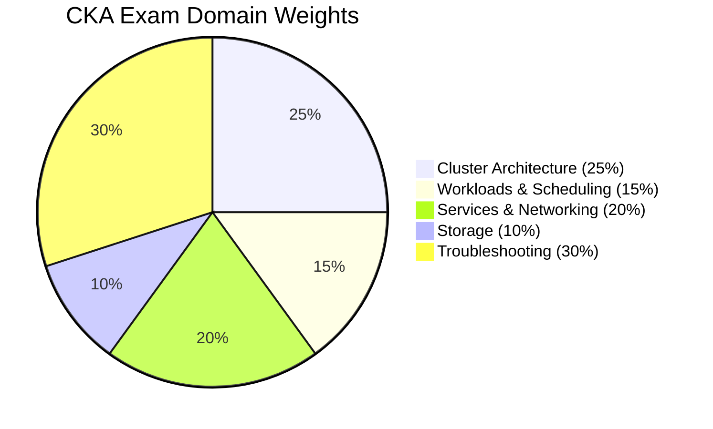

# CKA - Certified Kubernetes Administrator

The **Certified Kubernetes Administrator (CKA)** is a performance-based certification from the CNCF that validates your ability to install, configure, and manage production-grade Kubernetes clusters. It is the cornerstone certification for the Kubestronaut path and a prerequisite for the CKS exam.

## Exam Details

| Detail | Value |
|---|---|
| **Format** | Performance-based (hands-on CLI) |
| **Duration** | 2 hours |
| **Tasks** | 15-20 |
| **Passing Score** | 66% |
| **Cost** | $445 |
| **Validity** | 2 years |
| **Prerequisites** | None |
| **Delivery** | Online proctored (PSI Secure Browser) |
| **Allowed Resources** | [Kubernetes Documentation](https://kubernetes.io/docs/) (one extra browser tab) |
| **Retake** | 1 free retake included |
| **Simulator** | 2 killer.sh sessions included (36h each) |

!!! tip "Exam Tip"
    The exam is entirely hands-on in a Linux terminal. You must solve real Kubernetes tasks using `kubectl` and other CLI tools. Speed matters -- practice until common operations become muscle memory.

## Domain Breakdown

| Domain | Weight |
|---|---|
| [Cluster Architecture, Installation & Configuration](cluster-architecture.md) | 25% |
| [Workloads & Scheduling](workloads-scheduling.md) | 15% |
| [Services & Networking](services-networking.md) | 20% |
| [Storage](storage.md) | 10% |
| [Troubleshooting](troubleshooting.md) | 30% |
| **Total** | **100%** |



!!! tip "Exam Tip"
    **Troubleshooting** is the single largest domain at 30%. Combined with **Cluster Architecture** (25%), these two domains make up over half the exam. Invest the majority of your study time on cluster administration, debugging broken nodes, and fixing misconfigured resources.

## Study Progress

- [ ] [Cluster Architecture, Installation & Configuration](cluster-architecture.md) (25%)
- [ ] [Workloads & Scheduling](workloads-scheduling.md) (15%)
- [ ] [Services & Networking](services-networking.md) (20%)
- [ ] [Storage](storage.md) (10%)
- [ ] [Troubleshooting](troubleshooting.md) (30%)
- [ ] killer.sh simulator session 1
- [ ] killer.sh simulator session 2
- [ ] Final review and weak-area revision

## Useful kubectl Aliases and Shortcuts

Setting up aliases and shell shortcuts at the start of the exam saves significant time. The following are allowed during the exam (you set them up in your terminal):

```bash
# Essential aliases
alias k=kubectl
alias kn='kubectl config set-context --current --namespace'
alias kgp='kubectl get pods'
alias kgs='kubectl get svc'
alias kgn='kubectl get nodes'
alias kd='kubectl describe'
alias kaf='kubectl apply -f'
alias kdel='kubectl delete'

# Enable kubectl autocompletion
source <(kubectl completion bash)
complete -o default -F __start_kubectl k

# Set default editor (vim is pre-installed)
export EDITOR=vim
# or
export EDITOR=nano

# Dry-run shortcut for generating YAML
export do="--dry-run=client -o yaml"
# Usage: kubectl run nginx --image=nginx $do > pod.yaml
```

!!! tip "Exam Tip"
    The first thing you should do when the exam starts is set up your aliases and autocompletion. This investment of 1-2 minutes will save you many minutes throughout the exam. At minimum, set up `alias k=kubectl` and bash completion.

### Useful kubectl Commands for Speed

```bash
# Quickly generate YAML manifests without writing them from scratch
kubectl run nginx --image=nginx --dry-run=client -o yaml > pod.yaml
kubectl create deployment nginx --image=nginx --dry-run=client -o yaml > deploy.yaml
kubectl create service clusterip my-svc --tcp=80:80 --dry-run=client -o yaml > svc.yaml
kubectl create configmap my-cm --from-literal=key=value --dry-run=client -o yaml > cm.yaml

# Switch context/namespace quickly
kubectl config use-context <context-name>
kubectl config set-context --current --namespace=<namespace>

# Get resources across all namespaces
kubectl get pods -A
kubectl get all -A

# Quick resource inspection
kubectl get pods -o wide
kubectl get events --sort-by='.lastTimestamp'

# Explain API fields (useful for writing YAML)
kubectl explain pod.spec.containers
kubectl explain pod.spec.containers.resources
```

## Key Resources

### Official Resources

| Resource | Description |
|---|---|
| [CKA Curriculum (PDF)](https://github.com/cncf/curriculum) | Official exam curriculum maintained by CNCF |
| [CKA Certification Page](https://training.linuxfoundation.org/certification/certified-kubernetes-administrator-cka/) | Registration, handbook, and exam policies |
| [Kubernetes Documentation](https://kubernetes.io/docs/) | Official docs (accessible during the exam) |
| [kubectl Cheat Sheet](https://kubernetes.io/docs/reference/kubectl/cheatsheet/) | Official kubectl reference |

### Courses

| Course | Platform |
|---|---|
| Certified Kubernetes Administrator (CKA) with Practice Tests | KodeKloud / Udemy |
| Kubernetes Fundamentals (LFS258) | Linux Foundation |
| CKA Certification Course | A Cloud Guru |

### Practice Environments

| Resource | Description |
|---|---|
| [killer.sh](https://killer.sh/) | CKA exam simulator (2 sessions included with exam purchase) |
| [KodeKloud Labs](https://kodekloud.com/) | Interactive Kubernetes labs |
| [Play with Kubernetes](https://labs.play-with-k8s.com/) | Free browser-based Kubernetes playground |
| [kubeadm on Vagrant](https://kubernetes.io/docs/setup/production-environment/tools/kubeadm/) | Local multi-node cluster for practice |

### Community Resources

| Resource | Description |
|---|---|
| [walidshaari/Certified-Kubernetes-Administrator](https://github.com/walidshaari/Kubernetes-Certified-Administrator) | Curated CKA study resources |
| [dgkanatsios/CKAD-exercises](https://github.com/dgkanatsios/CKAD-exercises) | Hands-on exercises (many overlap with CKA) |
| [kubernetes-the-hard-way](https://github.com/kelseyhightower/kubernetes-the-hard-way) | Deep dive into cluster setup |
