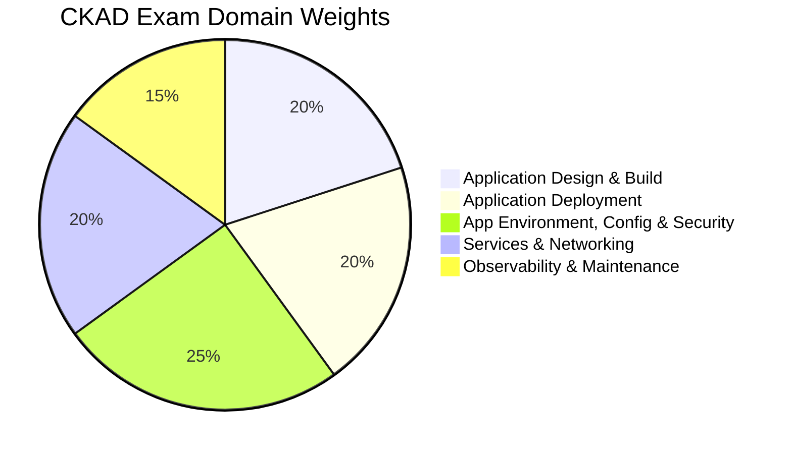

# CKAD - Certified Kubernetes Application Developer

The **Certified Kubernetes Application Developer (CKAD)** is a performance-based certification from the CNCF that validates your ability to design, build, configure, and expose cloud native applications for Kubernetes. Unlike the CKA which focuses on cluster administration, the CKAD is centered on the application developer perspective -- deploying, configuring, and troubleshooting applications running on Kubernetes.

## Exam Details

| Detail | Value |
|---|---|
| **Format** | Performance-based (hands-on CLI) |
| **Duration** | 2 hours |
| **Tasks** | 15-20 |
| **Passing Score** | 66% |
| **Cost** | $445 |
| **Validity** | 2 years |
| **Prerequisites** | None |
| **Delivery** | Online proctored (PSI Secure Browser) |
| **Allowed Resources** | [Kubernetes documentation](https://kubernetes.io/docs/) |

!!! tip "Exam Tip"
    The CKAD shares the same exam format as CKA (performance-based, 2 hours, 66% passing), but the focus shifts from cluster administration to application development workflows. If you already passed the CKA, many kubectl skills transfer directly.

## Domain Breakdown

| Domain | Weight |
|---|---|
| [Application Design and Build](application-design.md) | 20% |
| [Application Deployment](application-deployment.md) | 20% |
| [Application Environment, Configuration and Security](application-environment.md) | 25% |
| [Services and Networking](services-networking.md) | 20% |
| [Application Observability and Maintenance](observability.md) | 15% |
| **Total** | **100%** |



!!! tip "Exam Tip"
    **Application Environment, Configuration and Security** is the highest-weighted domain at 25%. Make sure you are comfortable with ConfigMaps, Secrets, SecurityContexts, ServiceAccounts, and resource management. The remaining four domains are evenly distributed at 15-20% each.

## Useful kubectl Aliases and Shortcuts

Setting up aliases at the start of the exam saves significant time. The following are commonly used during the CKAD:

```bash
# Essential aliases
alias k=kubectl
alias kn='kubectl config set-context --current --namespace'

# Shortcuts for dry-run YAML generation
export do="--dry-run=client -o yaml"

# Quick resource generation
alias krun='kubectl run --restart=Never'
alias kexpose='kubectl expose'

# Context and namespace shortcuts
alias kctx='kubectl config get-contexts'
alias kns='kubectl get namespaces'
```

Common time-saving patterns:

```bash
# Generate YAML without creating the resource
k run nginx --image=nginx $do > pod.yaml

# Create a resource and expose it in one flow
k create deployment web --image=nginx --replicas=3
k expose deployment web --port=80 --target-port=80

# Quick edit
k edit deployment web

# Use kubectl explain to look up fields during the exam
k explain pod.spec.containers.livenessProbe
k explain deployment.spec.strategy

# Fast deletion (skip graceful shutdown wait)
k delete pod nginx --grace-period=0 --force
```

!!! tip "Exam Tip"
    The `kubectl explain` command is your best friend during the exam. It provides built-in documentation for any resource field, so you do not need to leave the terminal to look up YAML structure. Use `--recursive` to see the full field tree: `kubectl explain pod.spec --recursive`.

## Key Resources

### Official Resources

| Resource | Description |
|---|---|
| [CKAD Curriculum (PDF)](https://github.com/cncf/curriculum) | Official exam curriculum maintained by CNCF |
| [CKAD Certification Page](https://training.linuxfoundation.org/certification/certified-kubernetes-application-developer-ckad/) | Registration, handbook, and exam policies |
| [Kubernetes Documentation](https://kubernetes.io/docs/) | Official docs (accessible during the exam) |
| [killer.sh](https://killer.sh/) | Official exam simulator (2 sessions included with purchase) |

### Courses

| Course | Platform |
|---|---|
| CKAD with Practice Tests (Mumshad Mannambeth) | Udemy |
| Certified Kubernetes Application Developer (CKAD) | KodeKloud |
| Kubernetes for Developers (LFD259) | Linux Foundation |

### Community Resources

| Resource | Description |
|---|---|
| [dgkanatsios/CKAD-exercises](https://github.com/dgkanatsios/CKAD-exercises) | Most popular CKAD exercise set |
| [bmuschko/ckad-crash-course](https://github.com/bmuschko/ckad-crash-course) | CKAD crash course with exercises |
| [Killercoda CKAD Scenarios](https://killercoda.com/) | Free interactive browser labs |
