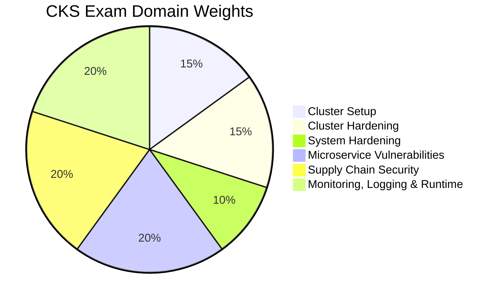

# CKS - Certified Kubernetes Security Specialist

The **Certified Kubernetes Security Specialist (CKS)** exam validates a candidate's ability to secure Kubernetes clusters and cloud native applications. It is widely considered the **most difficult** of the five CNCF Kubernetes certifications, as it requires deep hands-on expertise across cluster hardening, supply chain security, runtime threat detection, and more. The exam is entirely performance-based, meaning you must solve real security tasks in live Kubernetes environments under time pressure.

!!! warning "Hardest Exam in the Kubestronaut Path"
    The CKS is consistently rated as the most challenging of the five certifications. It requires solid CKA-level cluster administration skills **plus** extensive security knowledge. Do not underestimate the breadth of tooling (Falco, Trivy, AppArmor, seccomp, OPA/Gatekeeper, etc.) you are expected to know hands-on.

## Exam Details

| Detail | Information |
|---|---|
| **Format** | Performance-based (hands-on CLI) |
| **Duration** | 2 hours |
| **Tasks** | 15-20 |
| **Passing Score** | 67% |
| **Cost** | $445 |
| **Validity** | 2 years |
| **Prerequisites** | Active CKA certification |
| **Exam Platform** | PSI Online Proctoring |
| **Allowed Resources** | [Kubernetes Documentation](https://kubernetes.io/docs/), [Kubernetes Blog](https://kubernetes.io/blog/), [Trivy Documentation](https://aquasecurity.github.io/trivy/), [Falco Documentation](https://falco.org/docs/), [AppArmor Documentation](https://gitlab.com/apparmor/apparmor/-/wikis/Documentation) |
| **Registration** | [Linux Foundation Training Portal](https://training.linuxfoundation.org/certification/certified-kubernetes-security-specialist/) |

!!! tip "Exam Tip"
    The CKS is a performance-based exam where you work in real Kubernetes clusters via a terminal. You have access to the Kubernetes documentation and selected tool documentation during the exam. Bookmark key pages for NetworkPolicies, RBAC, Pod Security Standards, audit policies, and Falco rules before your exam session.

## Domain Breakdown

| Domain | Weight |
|---|---|
| [Cluster Setup](cluster-setup.md) | 15% |
| [Cluster Hardening](cluster-hardening.md) | 15% |
| [System Hardening](system-hardening.md) | 10% |
| [Minimize Microservice Vulnerabilities](microservice-vulnerabilities.md) | 20% |
| [Supply Chain Security](supply-chain-security.md) | 20% |
| [Monitoring, Logging and Runtime Security](monitoring-logging-runtime.md) | 20% |

!!! info "Focus Areas"
    **Minimize Microservice Vulnerabilities**, **Supply Chain Security**, and **Monitoring, Logging and Runtime Security** together account for **60%** of the exam. Prioritize these three domains in your study plan, but do not neglect the fundamentals covered in Cluster Setup and Hardening.

## Exam Tools Reference

These are the tools you are expected to know hands-on during the CKS exam:

| Tool | Purpose | Relevance |
|---|---|---|
| `kubectl` | Cluster management, RBAC, Secrets, PSA, NetworkPolicies | Critical |
| `kubeadm` | Cluster upgrades, KubeletConfiguration | High |
| `etcdctl` | Read Secrets from etcd, verify encryption at rest | High |
| `trivy` | Image vulnerability scanning, SBOM generation (CycloneDX), SBOM scanning | High |
| `falco` | Runtime security, custom rule authoring, syscall monitoring | High |
| `kube-bench` | CIS Benchmark checks and remediation | High |
| `bom` | SBOM generation (SPDX-JSON format) | Medium |
| `kubesec` | Static analysis for Kubernetes manifests | Medium |
| `kube-linter` | Static analysis for Kubernetes manifests and Helm charts | Medium |
| `apparmor_parser` | Load and manage AppArmor profiles | Medium |
| `crictl` | Container runtime debugging (list/inspect containers) | Medium |
| `openssl` | Certificate generation, CSR creation, TLS verification | Medium |
| `cosign` | Image signing and verification (Sigstore) | Medium |
| `strace` | Syscall tracing for building seccomp profiles | Low |

!!! info "Exam Documentation Access"
    During the exam you have access to: [Kubernetes Docs](https://kubernetes.io/docs/), [Trivy Docs](https://aquasecurity.github.io/trivy/), [Falco Docs](https://falco.org/docs/), and [AppArmor Docs](https://gitlab.com/apparmor/apparmor/-/wikis/Documentation). Bookmark key pages before the exam: NetworkPolicy, CiliumNetworkPolicy, RBAC, Pod Security Standards, Audit Policy, Falco Rules, and EncryptionConfiguration.

## Study Progress

- [ ] Cluster Setup (15%) — NetworkPolicies, CiliumNetworkPolicy, CIS Benchmarks, Ingress TLS, Metadata Protection, Binary Verification
- [ ] Cluster Hardening (15%) — RBAC, ServiceAccounts, API Server Hardening, TLS Settings, CSRs, Audit Logging, Kubernetes Upgrade
- [ ] System Hardening (10%) — AppArmor, Seccomp, Reduce Attack Surface, Host Namespace Restrictions
- [ ] Minimize Microservice Vulnerabilities (20%) — Pod Security Standards, OPA/Gatekeeper, Secrets, Encryption at Rest, gVisor, Cilium Mutual Auth, mTLS/Istio
- [ ] Supply Chain Security (20%) — Trivy, SBOM (bom + trivy), Static Analysis (kubesec + KubeLinter), Dockerfile Hardening, ImagePolicyWebhook, Image Signing (cosign)
- [ ] Monitoring, Logging and Runtime Security (20%) — Falco Custom Rules, Audit Logging, Immutable Containers, Behavioral Analytics, Incident Response
- [ ] Practice with killer.sh CKS simulator (2 free sessions included)
- [ ] Review weak areas and revisit tooling
- [ ] Schedule and take the exam

## Key Resources

| Resource | Description |
|---|---|
| [CKS Curriculum (PDF)](https://github.com/cncf/curriculum) | Official CNCF exam curriculum |
| [CKS Registration](https://training.linuxfoundation.org/certification/certified-kubernetes-security-specialist/) | Register for the CKS exam |
| [Kubernetes Security Docs](https://kubernetes.io/docs/concepts/security/) | Official Kubernetes security documentation |
| [Killer Shell CKS Simulator](https://killer.sh/cks) | Exam simulator included with registration (2 free sessions) |
| [Falco Documentation](https://falco.org/docs/) | Runtime security and threat detection |
| [Trivy Documentation](https://aquasecurity.github.io/trivy/) | Container image vulnerability scanning |
| [AppArmor Documentation](https://kubernetes.io/docs/tutorials/security/apparmor/) | Kubernetes AppArmor integration |
| [CKS Study Guide by Walid Shaari](https://github.com/walidshaari/Certified-Kubernetes-Security-Specialist) | Community-curated study resources |
| [Kim Wuestkamp's CKS Course](https://www.youtube.com/watch?v=d9xfB5qaOfg&list=PL6wzA02m1X7Ltf56oWzeUKZQ_ji5bBt9p) | Free video course on YouTube (11h+) |
| [Killercoda CKS Scenarios](https://killercoda.com/killer-shell-cks) | Free interactive browser-based labs |
| [KodeKloud CKS Course](https://kodekloud.com/) | Video course with hands-on labs |
