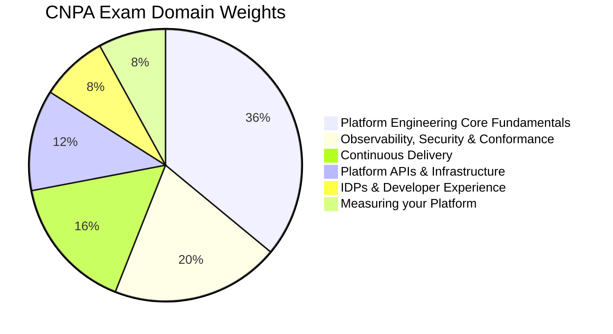

# CNPA - Certified Cloud Native Platform Engineering Associate

The **Certified Cloud Native Platform Engineering Associate (CNPA)** certification validates foundational knowledge of platform engineering, including platform architecture, observability, security, CI/CD, GitOps, infrastructure provisioning, and developer experience.

## Exam Details

| Detail | Value |
|---|---|
| **Format** | Multiple Choice |
| **Duration** | 120 minutes |
| **Questions** | 60 |
| **Passing Score** | 75% |
| **Cost** | $250 |
| **Validity** | 2 years |
| **Prerequisites** | None |
| **Delivery** | Online proctored (PSI Secure Browser) |

!!! info "Longer Duration"
    The CNPA has 120 minutes (vs. 90 minutes for most other associate exams), giving you 2 minutes per question.

## Domain Breakdown

| Domain | Weight |
|---|---|
| Platform Engineering Core Fundamentals | 36% |
| Platform Observability, Security, and Conformance | 20% |
| Continuous Delivery & Platform Engineering | 16% |
| Platform APIs and Provisioning Infrastructure | 12% |
| IDPs and Developer Experience | 8% |
| Measuring your Platform | 8% |
| **Total** | **100%** |

!!! tip "Exam Tip"
    Platform Engineering Core Fundamentals (36%) dominates the exam. Understand platform thinking, self-service, golden paths, declarative resource management, and DevOps practices. Combined with Observability, Security & Conformance (20%), these two domains account for 56% of the exam.

## Study Progress

- [ ] Platform Engineering Core Fundamentals (36%)
- [ ] Platform Observability, Security, and Conformance (20%)
- [ ] Continuous Delivery & Platform Engineering (16%)
- [ ] Platform APIs and Provisioning Infrastructure (12%)
- [ ] IDPs and Developer Experience (8%)
- [ ] Measuring your Platform (8%)
- [ ] Practice questions and mock exams
- [ ] Final review and weak-area revision

## Key Resources

### Official Resources

| Resource | Description |
|---|---|
| [CNPA Curriculum (PDF)](https://github.com/cncf/curriculum) | Official exam curriculum maintained by CNCF |
| [CNPA Certification Page](https://training.linuxfoundation.org/certification/certified-cloud-native-platform-engineering-associate-cnpa/) | Registration, handbook, and exam policies |
| [CNCF Platforms White Paper](https://tag-app-delivery.cncf.io/whitepapers/platforms/) | CNCF guidance on platform engineering |

### Courses

| Course | Platform |
|---|---|
| Certified Cloud Native Platform Engineering Associate (CNPA) | KodeKloud |
| CNPA Certification Prep | TeKanAid |

### Community Resources

| Resource | Description |
|---|---|
| [Platform Engineering Community](https://platformengineering.org/) | Community hub for platform engineering |
| [CNCF Blog — Introducing CNPA](https://www.cncf.io/blog/2025/06/15/introducing-the-certified-cloud-native-platform-engineering-associate-cnpa-community-driven-certification-for-platform-engineers/) | CNPA announcement and overview |
