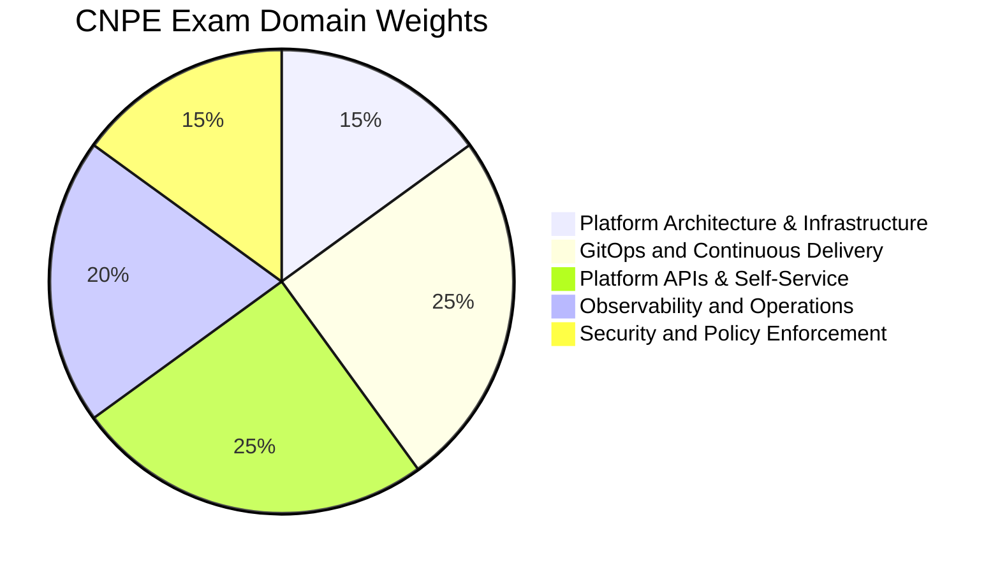

# CNPE - Certified Cloud Native Platform Engineer

The **Certified Cloud Native Platform Engineer (CNPE)** certification validates intermediate-level, hands-on skills in platform engineering. This is a **performance-based exam** covering GitOps, CI/CD, platform APIs, self-service capabilities, observability, and security in a live environment.

## Exam Details

| Detail | Value |
|---|---|
| **Format** | Performance-based (hands-on) |
| **Duration** | 120 minutes |
| **Questions** | ~20 tasks |
| **Passing Score** | 64% |
| **Cost** | $445 |
| **Validity** | 2 years |
| **Prerequisites** | None (CNPA-level knowledge recommended) |
| **Delivery** | Online proctored (PSI Secure Browser) |
| **Environment** | Linux-based remote desktop with terminal and web interfaces |

!!! warning "Performance-based Exam"
    The CNPE exam is hands-on (similar to CKA/CKAD). You will work in a live environment with real clusters and platform tooling. No multiple-choice questions.

## Domain Breakdown

| Domain | Weight |
|---|---|
| Platform Architecture and Infrastructure | 15% |
| GitOps and Continuous Delivery | 25% |
| Platform APIs and Self-Service Capabilities | 25% |
| Observability and Operations | 20% |
| Security and Policy Enforcement | 15% |
| **Total** | **100%** |

!!! tip "Exam Tip"
    GitOps and Continuous Delivery (25%) and Platform APIs and Self-Service (25%) together account for 50% of the exam. Master GitOps workflows, CI/CD pipelines, progressive delivery strategies, CRDs, operators, and self-service provisioning.

## Study Progress

- [ ] Platform Architecture and Infrastructure (15%)
- [ ] GitOps and Continuous Delivery (25%)
- [ ] Platform APIs and Self-Service Capabilities (25%)
- [ ] Observability and Operations (20%)
- [ ] Security and Policy Enforcement (15%)
- [ ] Practice with killer.sh simulator
- [ ] Final review and weak-area revision

## Key Resources

### Official Resources

| Resource | Description |
|---|---|
| [CNPE Curriculum (PDF)](https://github.com/cncf/curriculum) | Official exam curriculum maintained by CNCF |
| [CNPE Certification Page](https://training.linuxfoundation.org/certification/certified-cloud-native-platform-engineer-cnpe/) | Registration, handbook, and exam policies |
| [killer.sh](https://killer.sh/) | Official exam simulator (included with purchase) |
| [CNCF Platforms White Paper](https://tag-app-delivery.cncf.io/whitepapers/platforms/) | CNCF guidance on platform engineering |

### Courses

| Course | Platform |
|---|---|
| Platform Engineering on Kubernetes | Manning |
| GitOps and Progressive Delivery | Codefresh / Akuity |

### Community Resources

| Resource | Description |
|---|---|
| [CNCF Blog — CNPE Launch](https://www.cncf.io/announcements/2025/11/11/cncf-launches-cnpe-certification-to-define-enterprise-scale-platform-engineering-globally/) | CNPE announcement |
| [Platform Engineering Community](https://platformengineering.org/) | Community hub for platform engineering |
