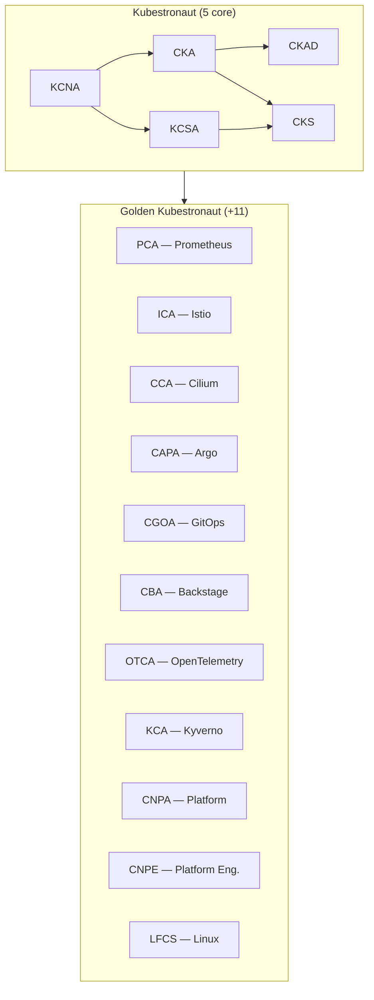

# Golden Kubestronaut

The **[Golden Kubestronaut](https://www.cncf.io/training/kubestronaut/)** extends the Kubestronaut program by requiring **all 16 CNCF certifications** to be active simultaneously. It covers the full breadth of the cloud native ecosystem — from Kubernetes and security to observability, service mesh, GitOps, and platform engineering.

## Required Certifications

In addition to the [5 core Kubestronaut certifications](kubestronaut.md), Golden Kubestronaut requires these 11 certifications:

| Certification | Full Name | Type | Duration | Passing Score |
|---|---|---|---|---|
| [PCA](pca/index.md) | Prometheus Certified Associate | Multiple Choice | 90 min | 75% |
| [ICA](ica/index.md) | Istio Certified Associate | Performance-based | 2 hours | 68% |
| [CCA](cca/index.md) | Cilium Certified Associate | Multiple Choice | 90 min | 75% |
| [CAPA](capa/index.md) | Certified Argo Project Associate | Multiple Choice | 90 min | 75% |
| [CGOA](cgoa/index.md) | Certified GitOps Associate | Multiple Choice | 90 min | 75% |
| [CBA](cba/index.md) | Certified Backstage Associate | Multiple Choice | 90 min | 75% |
| [OTCA](otca/index.md) | OpenTelemetry Certified Associate | Multiple Choice | 90 min | 75% |
| [KCA](kca/index.md) | Kyverno Certified Associate | Multiple Choice | 90 min | 75% |
| [CNPA](cnpa/index.md) | Cloud Native Platform Apprentice | Multiple Choice | 120 min | 75% |
| [CNPE](cnpe/index.md) | Certified Cloud Native Platform Engineer | Performance-based | 2 hours | 64% |
| [LFCS](lfcs/index.md) | Linux Foundation Certified System Administrator | Performance-based | 2 hours | 67% |

## Certification Map

!!! info "Golden Kubestronaut Bundle"
    The [Golden Kubestronaut Bundle](https://training.linuxfoundation.org/certification/golden-kubestronaut-bundle/) includes all 16 exams at a significant discount. Also look for Linux Foundation discount codes (30-55% off) during sales events like CyberMonday and KubeCon.

## Tips

- Most of the additional certs are **multiple choice** and significantly easier than the performance-based Kubestronaut exams
- **ICA** (Istio), **CNPE** (Platform Engineering), and **LFCS** (Linux) are performance-based and require hands-on preparation
- The additional certs have **no prerequisites** — you can take them in any order
- Start with certs that overlap with your daily work to minimize study time

## Resources

- [Golden Kubestronaut Program](https://www.cncf.io/training/kubestronaut/)
- [Golden Kubestronaut Bundle](https://training.linuxfoundation.org/certification/golden-kubestronaut-bundle/)
- [Linux Foundation Training Portal](https://training.linuxfoundation.org/)
