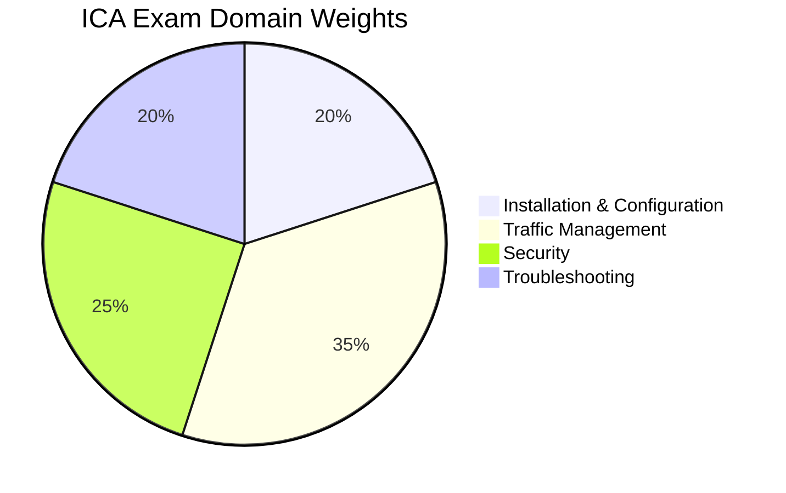

# ICA - Istio Certified Associate

The **Istio Certified Associate (ICA)** certification validates hands-on skills with Istio service mesh, including installation, traffic management, security, and troubleshooting. This is a **performance-based exam** requiring practical Istio experience in a live environment.

## Exam Details

| Detail | Value |
|---|---|
| **Format** | Performance-based (hands-on) |
| **Duration** | 120 minutes |
| **Questions** | ~15-20 tasks |
| **Passing Score** | 68% |
| **Cost** | $250 |
| **Validity** | 2 years |
| **Prerequisites** | None |
| **Delivery** | Online proctored (PSI Secure Browser) |
| **Open Book** | Yes — Istio docs, Istio Blog, Kubernetes docs |

!!! warning "Performance-based Exam"
    The ICA exam is hands-on (similar to CKA/CKAD). You will work in a live terminal environment with real Istio clusters. No multiple-choice questions.

## Domain Breakdown

| Domain | Weight |
|---|---|
| Installation & Configuration | 20% |
| Traffic Management | 35% |
| Security | 25% |
| Troubleshooting | 20% |
| **Total** | **100%** |

!!! tip "Exam Tip"
    Traffic Management is the largest domain at 35%. Master VirtualService, DestinationRule, Gateway resources, traffic shifting, and resilience features (circuit breaking, retries, timeouts). Combined with Security (25%), these two domains account for 60% of the exam.

## Key Resources

### Official Resources

| Resource | Description |
|---|---|
| [ICA Curriculum (PDF)](https://github.com/cncf/curriculum) | Official exam curriculum maintained by CNCF |
| [ICA Certification Page](https://training.linuxfoundation.org/certification/istio-certified-associate-ica/) | Registration, handbook, and exam policies |
| [Istio Documentation](https://istio.io/latest/docs/) | Official Istio docs (allowed during exam) |
| [killer.sh](https://killer.sh/) | Official exam simulator (included with purchase) |

### Courses

| Course | Platform |
|---|---|
| Istio Certified Associate (ICA) | KodeKloud |
| Istio Service Mesh | Tetrate Academy |

### Community Resources

| Resource | Description |
|---|---|
| [DevOpsCube ICA Study Guide](https://devopscube.com/istio-certified-associate-study-guide/) | Blog-style study guide |
| [Istio by Example](https://istiobyexample.dev/) | Practical Istio patterns |
