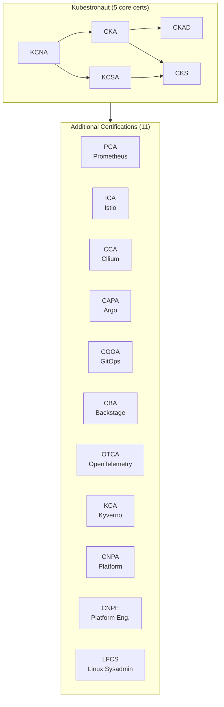

# Golden Kubestronaut Study Guide

Personal study guide and exam preparation resources for the [CNCF Golden Kubestronaut](https://www.cncf.io/training/kubestronaut/) certification path — all 16 CNCF certifications.

## What is Golden Kubestronaut?

The **Kubestronaut** program recognizes individuals who hold all five core Kubernetes certifications (KCNA, KCSA, CKA, CKAD, CKS) simultaneously. The **Golden Kubestronaut** takes this further by requiring **all 16 CNCF certifications** to be active at the same time, covering the full breadth of the cloud native ecosystem.

Benefits include an exclusive jacket, discount coupons for recertification, KubeCon event discounts, and recognition in the CNCF community.

## Certification Path

The 5 core Kubestronaut certifications plus the 11 additional certifications required for Golden Kubestronaut:

!!! tip "Timing"
    All 16 certifications must be **active simultaneously** (each valid for 2-3 years depending on the cert). Plan your schedule carefully so earlier certs don't expire before completing the remaining ones.

## Progress Tracker

### Kubestronaut (5 core)

- [x] KCNA - Kubernetes and Cloud Native Associate
- [x] KCSA - Kubernetes and Cloud Native Security Associate
- [x] CKA - Certified Kubernetes Administrator (renewal needed)
- [ ] CKAD - Certified Kubernetes Application Developer
- [ ] CKS - Certified Kubernetes Security Specialist

### Additional Certifications (11)

- [ ] PCA - Prometheus Certified Associate
- [ ] ICA - Istio Certified Associate
- [ ] CCA - Cilium Certified Associate
- [ ] CAPA - Certified Argo Project Associate
- [ ] CGOA - Certified GitOps Associate
- [ ] CBA - Certified Backstage Associate
- [ ] OTCA - OpenTelemetry Certified Associate
- [ ] KCA - Kyverno Certified Associate
- [ ] CNPA - Cloud Native Platform Associate
- [ ] CNPE - Cloud Native Platform Engineer
- [ ] LFCS - Linux Foundation Certified Sysadmin

## Certification Overview

### Kubestronaut (Core 5)

| Certification | Type | Duration | Passing Score | Cost | Prerequisite |
|---|---|---|---|---|---|
| [KCNA](kcna/index.md) | Multiple Choice | 90 min | 75% | $250 | None |
| [KCSA](kcsa/index.md) | Multiple Choice | 90 min | 75% | $250 | None |
| [CKA](cka/index.md) | Performance-based | 2 hours | 66% | $445 | None |
| [CKAD](ckad/index.md) | Performance-based | 2 hours | 66% | $445 | None |
| [CKS](cks/index.md) | Performance-based | 2 hours | 67% | $445 | Active CKA |

### Additional Certifications (11)

| Certification | Type | Duration | Passing Score | Cost | Prerequisite |
|---|---|---|---|---|---|
| [PCA](pca/index.md) | Multiple Choice | 90 min | 75% | $250 | None |
| [ICA](ica/index.md) | Performance-based | 2 hours | 68% | $250 | None |
| [CCA](cca/index.md) | Multiple Choice | 90 min | 75% | $250 | None |
| [CAPA](capa/index.md) | Multiple Choice | 90 min | 75% | $250 | None |
| [CGOA](cgoa/index.md) | Multiple Choice | 90 min | 75% | $250 | None |
| [CBA](cba/index.md) | Multiple Choice | 90 min | 75% | $250 | None |
| [OTCA](otca/index.md) | Multiple Choice | 90 min | 75% | $250 | None |
| [KCA](kca/index.md) | Multiple Choice | 90 min | 75% | $250 | None |
| [CNPA](cnpa/index.md) | Multiple Choice | 120 min | 75% | $250 | None |
| [CNPE](cnpe/index.md) | Performance-based | 2 hours | 64% | $445 | None |
| [LFCS](lfcs/index.md) | Performance-based | 2 hours | 67% | $445 | None |

!!! info "Golden Kubestronaut Bundle"
    The [Golden Kubestronaut Bundle](https://training.linuxfoundation.org/certification/golden-kubestronaut-bundle/) includes all 16 exams at a discount. Also look for Linux Foundation discount codes (30-55% off) during sales events like CyberMonday and KubeCon.

## Exam Environment (Performance-based)

The CKA, CKAD, CKS, ICA, CNPE, and LFCS exams are hands-on, command-line based exams in a browser terminal. Key rules:

- Access to specific official documentation is allowed (varies by exam)
- One additional browser tab is permitted for docs
- No personal notes, bookmarks, or other resources
- [killer.sh](https://killer.sh/) simulator sessions are included with exam purchase (2 sessions, 36h each)
- PSI Secure Browser is required for proctoring

## Exam Simulator

Test your knowledge with the built-in **[Exam Simulator](quiz/index.html)** — practice questions across all certifications with exam mode (timed, pass/fail scoring), progress tracking, and a question browser.

[Start Quiz](quiz/index.html){ .md-button .md-button--primary }
[Browse All Questions](quiz/browse.html){ .md-button }

## Quick Links

- [Official CNCF Curriculum Repository](https://github.com/cncf/curriculum)
- [Kubestronaut Program](https://www.cncf.io/training/kubestronaut/)
- [Linux Foundation Training Portal](https://training.linuxfoundation.org/)
- [Kubernetes Documentation](https://kubernetes.io/docs/)
- [killer.sh Exam Simulator](https://killer.sh/)
