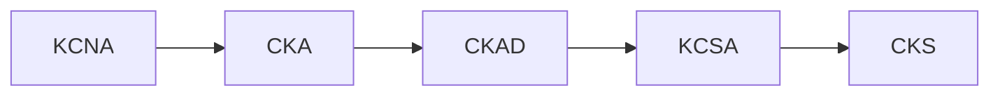

# Kubestronaut Study Guide

Personal study guide and exam preparation resources for the [CNCF Kubestronaut](https://www.cncf.io/training/kubestronaut/) certification path.

## What is Kubestronaut?

The **Kubestronaut** program recognizes individuals who hold all five Kubernetes certifications simultaneously. Benefits include an exclusive jacket, discount coupons for recertification, and KubeCon event discounts.

## Certification Path

The recommended order for earning all five certifications:

!!! tip "Timing"
    All 5 certifications must be **active simultaneously** (each valid for 2 years). Plan your schedule so your first cert doesn't expire before completing the fifth.

## Progress Tracker

- [x] CKA - Certified Kubernetes Administrator (renewal needed)
- [ ] KCNA - Kubernetes and Cloud Native Associate
- [ ] CKAD - Certified Kubernetes Application Developer
- [ ] KCSA - Kubernetes and Cloud Native Security Associate
- [ ] CKS - Certified Kubernetes Security Specialist

## Certification Overview

| Certification | Type | Duration | Passing Score | Cost | Prerequisite |
|---|---|---|---|---|---|
| [KCNA](kcna/index.md) | Multiple Choice | 90 min | 75% | $250 | None |
| [KCSA](kcsa/index.md) | Multiple Choice | 90 min | 75% | $250 | None |
| [CKA](cka/index.md) | Performance-based | 2 hours | 66% | $445 | None |
| [CKAD](ckad/index.md) | Performance-based | 2 hours | 66% | $445 | None |
| [CKS](cks/index.md) | Performance-based | 2 hours | 67% | $445 | Active CKA |

!!! info "Kubestronaut Bundle"
    The [Kubestronaut Bundle](https://training.linuxfoundation.org/certification/kubestronaut-bundle/) includes all 5 exams for **~$1,595** (vs. $1,835 individually). Look for Linux Foundation discount codes (30-55% off) during sales events.

## Exam Environment (Performance-based)

The CKA, CKAD, and CKS exams are hands-on, command-line based exams in a browser terminal. Key rules:

- Access to the [official Kubernetes documentation](https://kubernetes.io/docs/) is allowed
- One additional browser tab is permitted for docs
- No personal notes, bookmarks, or other resources
- [killer.sh](https://killer.sh/) simulator sessions are included with exam purchase (2 sessions, 36h each)
- PSI Secure Browser is required for proctoring

## Exam Simulator

Test your knowledge with the built-in **[Exam Simulator](quiz/index.html)** — 150 practice questions across all 5 certifications with exam mode (timed, pass/fail scoring), progress tracking, and a question browser.

[Start Quiz](quiz/index.html){ .md-button .md-button--primary }
[Browse All Questions](quiz/browse.html){ .md-button }

## Quick Links

- [Official CNCF Curriculum Repository](https://github.com/cncf/curriculum)
- [Kubestronaut Program](https://www.cncf.io/training/kubestronaut/)
- [Linux Foundation Training Portal](https://training.linuxfoundation.org/)
- [Kubernetes Documentation](https://kubernetes.io/docs/)
- [killer.sh Exam Simulator](https://killer.sh/)
