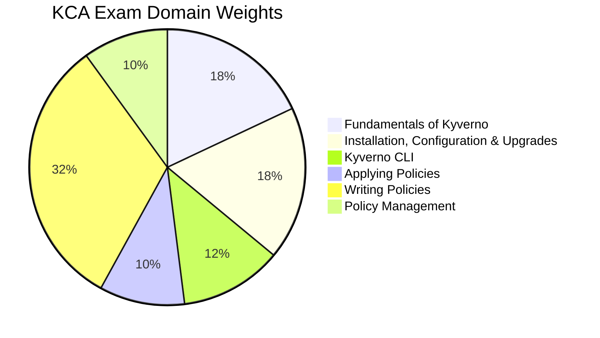

# KCA - Kyverno Certified Associate

The **Kyverno Certified Associate (KCA)** certification validates foundational knowledge of Kyverno, the Kubernetes-native policy engine. It covers policy authoring (validation, mutation, generation), policy management, the Kyverno CLI, and image verification.

## Exam Details

| Detail | Value |
|---|---|
| **Format** | Multiple Choice |
| **Duration** | 90 minutes |
| **Questions** | 60 |
| **Passing Score** | 75% |
| **Cost** | $250 |
| **Validity** | 2 years |
| **Prerequisites** | None |
| **Delivery** | Online proctored (PSI Secure Browser) |

## Domain Breakdown

| Domain | Weight |
|---|---|
| Fundamentals of Kyverno | 18% |
| Installation, Configuration, and Upgrades | 18% |
| Kyverno CLI | 12% |
| Applying Policies | 10% |
| Writing Policies | 32% |
| Policy Management | 10% |
| **Total** | **100%** |

!!! tip "Exam Tip"
    Writing Policies (32%) is the largest domain. Master validation rules, mutation (JSONPatch, strategic merge patch), generation policies, variables, JMESPath expressions, and Pod Security Standards. Combined with Fundamentals (18%) and Installation (18%), these three domains cover 68% of the exam.

## Study Progress

- [ ] Fundamentals of Kyverno (18%)
- [ ] Installation, Configuration, and Upgrades (18%)
- [ ] Kyverno CLI (12%)
- [ ] Applying Policies (10%)
- [ ] Writing Policies (32%)
- [ ] Policy Management (10%)
- [ ] Practice questions and mock exams
- [ ] Final review and weak-area revision

## Key Resources

### Official Resources

| Resource | Description |
|---|---|
| [KCA Curriculum (PDF)](https://github.com/cncf/curriculum) | Official exam curriculum maintained by CNCF |
| [KCA Certification Page](https://training.linuxfoundation.org/certification/kyverno-certified-associate-kca/) | Registration, handbook, and exam policies |
| [Kyverno Documentation](https://kyverno.io/docs/) | Official Kyverno docs |
| [Kyverno Policies Library](https://kyverno.io/policies/) | Ready-to-use policy examples |

### Courses

| Course | Platform |
|---|---|
| Kyverno Certified Associate (KCA) | KodeKloud |
| Kyverno Fundamentals | Nirmata Academy |

### Community Resources

| Resource | Description |
|---|---|
| [KCA Study Guide](https://ravikirans.com/kca-kyverno-certified-associate-study-guide/) | Community study guide |
| [Kyverno GitHub](https://github.com/kyverno/kyverno) | Official Kyverno repository |
