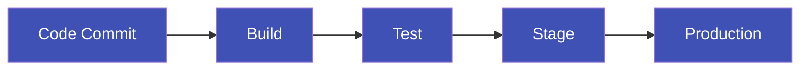

# Cloud Native Application Delivery (16%)

This domain covers how cloud native applications are built, packaged, and deployed to Kubernetes clusters. You need to understand CI/CD pipelines, GitOps principles, and the key tools in the Kubernetes application delivery ecosystem including Helm, Kustomize, ArgoCD, and Flux.

!!! tip "Exam Tip"
    Focus on understanding the **principles** behind GitOps and CI/CD rather than memorizing tool-specific commands. Know what makes GitOps different from traditional CI/CD and be able to identify which tools implement GitOps (ArgoCD, Flux) vs general CI/CD (Jenkins, GitHub Actions, GitLab CI).

## CI/CD Concepts

### Continuous Integration (CI)

Continuous Integration is the practice of frequently merging code changes into a shared repository, where automated builds and tests are run to detect problems early.

Key practices:

- Developers commit code frequently (at least daily).
- Every commit triggers an automated build and test pipeline.
- Build failures are fixed immediately.
- Automated tests provide fast feedback on code quality.

### Continuous Delivery (CD)

Continuous Delivery extends CI by ensuring that code is always in a deployable state. Every change that passes automated tests can be released to production at any time with the push of a button.

### Continuous Deployment

Continuous Deployment goes one step further: every change that passes all pipeline stages is automatically deployed to production without manual intervention.

### CI/CD in the Kubernetes Context

A typical Kubernetes CI/CD pipeline:

1. Developer pushes code to a Git repository.
2. CI system builds a container image.
3. Image is tagged and pushed to a container registry.
4. Kubernetes manifests are updated with the new image tag.
5. Changes are applied to the cluster (push-based or pull-based via GitOps).

Common CI/CD tools:

- **Jenkins** -- Open-source automation server, widely used for CI/CD.
- **GitHub Actions** -- CI/CD integrated into GitHub.
- **GitLab CI/CD** -- CI/CD integrated into GitLab.
- **Tekton** -- Kubernetes-native CI/CD framework (CNCF project).

## GitOps Principles

GitOps is a set of practices that uses Git repositories as the single source of truth for declarative infrastructure and application configuration. It was popularized by Weaveworks and is now a widely adopted pattern for Kubernetes.

### Core Principles

1. **Declarative** -- The entire system (infrastructure and applications) is described declaratively (e.g., Kubernetes YAML manifests, Helm charts).
2. **Versioned and Immutable** -- The desired state is stored in Git, providing a complete audit trail with version history.
3. **Pulled Automatically** -- Approved changes are automatically applied to the system by software agents.
4. **Continuously Reconciled** -- Software agents continuously observe the actual system state and attempt to match it to the desired state in Git. Drift is automatically corrected.

### Push vs Pull Model

| Aspect | Push-based CD | Pull-based CD (GitOps) |
|---|---|---|
| Trigger | CI pipeline pushes changes to the cluster | Agent in the cluster pulls changes from Git |
| Credentials | CI system needs cluster credentials | Agent runs inside the cluster |
| Drift detection | None (apply and forget) | Continuous reconciliation |
| Audit trail | Pipeline logs | Git history |
| Security | External access to cluster required | No external access needed |
| Examples | Jenkins, GitHub Actions | ArgoCD, Flux |

!!! tip "Exam Tip"
    The key differentiator of GitOps is the **pull-based model with continuous reconciliation**. If someone manually changes a resource in the cluster, a GitOps agent will detect the drift and revert it to match the state defined in Git.

## Helm

[Helm](https://helm.sh/) is the package manager for Kubernetes. It is a CNCF graduated project that simplifies deploying and managing Kubernetes applications.

### Key Concepts

- **Chart** -- A Helm package containing all the Kubernetes resource definitions needed to run an application. Charts are reusable and configurable.
- **Release** -- A specific instance of a chart deployed to a cluster. You can install the same chart multiple times, each creating a new release.
- **Repository** -- A collection of Helm charts that can be shared and discovered (e.g., Artifact Hub).
- **Values** -- Configuration parameters that customize a chart deployment. Defined in `values.yaml` or passed via `--set` flags.

### How Helm Works

- Charts use Go templates to generate Kubernetes manifests.
- Default values are defined in `values.yaml` and can be overridden at install time.
- Helm tracks releases with release history, enabling rollbacks.
- Charts can declare dependencies on other charts.

### Common Helm Commands

| Command | Purpose |
|---|---|
| `helm repo add` | Add a chart repository |
| `helm search repo` | Search for charts in repositories |
| `helm install` | Install a chart as a new release |
| `helm upgrade` | Upgrade an existing release |
| `helm rollback` | Roll back to a previous release version |
| `helm uninstall` | Remove a release |
| `helm list` | List installed releases |

## Kustomize

[Kustomize](https://kustomize.io/) is a Kubernetes-native configuration management tool that uses a template-free approach. It is built into `kubectl` (via `kubectl apply -k`).

### Key Concepts

- **Base** -- A set of Kubernetes manifests that represent the default configuration.
- **Overlay** -- A set of patches that customize the base for a specific environment (e.g., dev, staging, production).
- **kustomization.yaml** -- The configuration file that ties bases and overlays together.
- **Patches** -- JSON or strategic merge patches that modify base resources.

### Helm vs Kustomize

| Aspect | Helm | Kustomize |
|---|---|---|
| Approach | Templating | Patching/Overlays |
| Packaging | Charts with dependencies | Plain YAML with overlays |
| Learning curve | Moderate (Go templates) | Lower (no templating) |
| Reusability | High (chart repositories) | Moderate (bases and overlays) |
| Built into kubectl | No | Yes (`kubectl apply -k`) |
| Release management | Yes (history, rollback) | No |

## ArgoCD

[ArgoCD](https://argo-cd.readthedocs.io/) is a declarative, GitOps continuous delivery tool for Kubernetes. It is part of the CNCF Argo project (graduated).

### Key Features

- Continuously monitors Git repositories for changes.
- Automatically syncs the desired state from Git to the cluster.
- Provides a web UI and CLI for managing applications.
- Supports Helm, Kustomize, Jsonnet, and plain YAML.
- Detects and visualizes drift between desired and live state.
- Supports multi-cluster deployments.
- Provides RBAC and SSO integration.

### ArgoCD Architecture

ArgoCD runs as a set of controllers inside the Kubernetes cluster. It follows the pull-based GitOps model:

1. ArgoCD watches a Git repository for changes.
2. When a change is detected (or on a schedule), it compares the desired state in Git with the live state in the cluster.
3. If drift is detected, it can automatically sync (auto-sync) or wait for manual approval.
4. The sync process applies the Kubernetes manifests to the cluster.

## Flux

[Flux](https://fluxcd.io/) is a set of continuous and progressive delivery solutions for Kubernetes. It is a CNCF graduated project.

### Key Features

- GitOps toolkit built on Kubernetes controllers.
- Supports Helm, Kustomize, and plain YAML.
- Image automation -- can monitor container registries and update Git when new images are available.
- Multi-tenancy support.
- Notification system for alerts (Slack, Teams, webhooks).
- Progressive delivery via integration with Flagger.

### Flux vs ArgoCD

| Aspect | ArgoCD | Flux |
|---|---|---|
| Architecture | Centralized, application-centric | Distributed, toolkit-based |
| UI | Built-in web UI | No built-in UI (third-party options) |
| Multi-tenancy | Via RBAC and projects | Native multi-tenancy |
| Image automation | Via Argo Image Updater | Built-in |
| CNCF status | Graduated (Argo project) | Graduated |

Both tools implement GitOps principles and are suitable for production use. The choice often depends on team preferences and existing tooling.

## Application Delivery Patterns

### Blue/Green Deployment

Two identical environments (blue and green) run simultaneously. Traffic is switched from the current version (blue) to the new version (green) after testing. Provides instant rollback by switching back.

### Canary Deployment

A new version is gradually rolled out to a small subset of users before being deployed to the entire infrastructure. Allows testing in production with minimal risk.

### Rolling Update

Instances of the old version are gradually replaced with instances of the new version. This is the default deployment strategy in Kubernetes Deployments (`RollingUpdate` strategy).

### A/B Testing

Different versions are served to different user groups based on specific criteria (headers, cookies, geographic location). Used to test features with real users.

## Important Links

- [Helm Documentation](https://helm.sh/docs/)
- [Kustomize Documentation](https://kustomize.io/)
- [ArgoCD Documentation](https://argo-cd.readthedocs.io/)
- [Flux Documentation](https://fluxcd.io/docs/)
- [OpenGitOps](https://opengitops.dev/)
- [Tekton](https://tekton.dev/)
- [Artifact Hub](https://artifacthub.io/)

## Practice Questions

??? question "What is the key difference between a push-based CI/CD pipeline and a pull-based GitOps approach?"
    Consider how changes reach the Kubernetes cluster in each model.

    ??? success "Answer"
        In a **push-based** CI/CD pipeline, the CI system pushes changes directly to the cluster (e.g., running `kubectl apply` from Jenkins or GitHub Actions). This requires the CI system to have credentials for the cluster. In a **pull-based GitOps** approach, an agent running inside the cluster (e.g., ArgoCD or Flux) pulls the desired state from a Git repository and applies it. The key advantages of pull-based are: no external cluster access needed, continuous drift detection and reconciliation, and a complete audit trail in Git.

??? question "What is a Helm chart and how does it differ from a plain Kubernetes manifest?"
    Think about packaging, templating, and reusability.

    ??? success "Answer"
        A **Helm chart** is a package that bundles all the Kubernetes resource definitions needed for an application, along with configurable templates and default values. Unlike plain Kubernetes manifests (static YAML files), Helm charts use **Go templates** with a `values.yaml` file, allowing the same chart to be customized for different environments without duplicating YAML. Charts also support **versioning**, **dependencies** on other charts, **release management** with rollback capabilities, and distribution via **chart repositories**.

??? question "How does Kustomize differ from Helm in managing environment-specific configurations?"
    Consider the template-free approach vs the templating approach.

    ??? success "Answer"
        **Helm** uses a templating approach: base manifests contain Go template placeholders that are filled in with values from `values.yaml` at install time. **Kustomize** uses a template-free, overlay-based approach: you start with unmodified base YAML manifests and apply patches (strategic merge patches or JSON patches) via overlays for each environment. Kustomize overlays reference the base and specify only what changes, keeping the base manifests as valid, readable Kubernetes YAML. Kustomize is built into kubectl (`kubectl apply -k`), while Helm requires a separate CLI.

??? question "What happens when someone manually modifies a Kubernetes resource in a cluster managed by ArgoCD with auto-sync enabled?"
    Think about the continuous reconciliation aspect of GitOps.

    ??? success "Answer"
        ArgoCD will detect the **drift** between the live state in the cluster and the desired state defined in the Git repository. With auto-sync enabled, ArgoCD will automatically **revert the manual change** by reapplying the desired state from Git. This continuous reconciliation is a core principle of GitOps -- Git is always the source of truth, and any deviation is automatically corrected. The manual change would effectively be overwritten.

??? question "A team wants to deploy the same application to development, staging, and production clusters with different configurations. Which tool uses a patching approach instead of templating?"
    Consider the fundamental design philosophy of each tool.

    ??? success "Answer"
        **Kustomize** uses a patching/overlay approach. The team would create a `base` directory with the common Kubernetes manifests and then create separate overlay directories for each environment (`dev`, `staging`, `production`). Each overlay contains only the differences (patches) from the base, such as different replica counts, resource limits, or image tags. The base manifests remain as plain, valid Kubernetes YAML without any template syntax, making them easier to read and validate.
