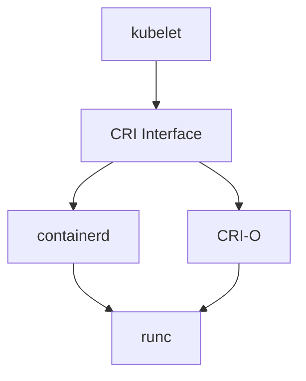

# Container Orchestration (28%)

This domain covers the fundamentals of containers and how container orchestration solves the challenges of running containerized applications at scale. You need to understand the container ecosystem (OCI standards, runtimes, registries), core orchestration concepts, and how Kubernetes compares to other orchestration platforms.

!!! tip "Exam Tip"
    This domain bridges the gap between "what containers are" and "why we need Kubernetes." Make sure you understand the problems that orchestration solves (scheduling, scaling, self-healing, service discovery) and the standards that make the ecosystem interoperable (OCI, CRI).

## Container Fundamentals

### What is a Container?

A container is a lightweight, standalone, executable package that includes everything needed to run a piece of software: code, runtime, system tools, libraries, and settings. Containers use OS-level virtualization (Linux namespaces and cgroups) to provide isolation.

Key differences between containers and virtual machines:

| Aspect | Containers | Virtual Machines |
|---|---|---|
| Isolation | Process-level (shared kernel) | Hardware-level (separate kernel) |
| Startup time | Seconds | Minutes |
| Size | Megabytes | Gigabytes |
| Overhead | Minimal | Significant |
| Density | High (many per host) | Lower (fewer per host) |

### OCI (Open Container Initiative)

The [Open Container Initiative](https://opencontainers.org/) defines industry standards for container formats and runtimes. The two main specifications are:

- **OCI Image Spec** -- Defines the format for container images (layers, manifests, configuration).
- **OCI Runtime Spec** -- Defines how to run a container from an image. The reference implementation is **runc**.
- **OCI Distribution Spec** -- Defines a standard API for distributing container images (registry API).

OCI standards ensure that images built with one tool can run on any compliant runtime.

### Container Images

A container image is a read-only template used to create containers. Images are built in layers, where each layer represents a filesystem change (adding files, installing packages, etc.).

- Images are identified by a registry, repository, and tag (e.g., `docker.io/library/nginx:1.25`).
- If no tag is specified, `latest` is used by default.
- Image layers are shared between images to save disk space and network bandwidth.
- A **Dockerfile** (or **Containerfile**) defines the steps to build an image.

### Container Registries

A container registry is a storage and distribution service for container images. Examples include:

- **Docker Hub** (`docker.io`) -- The default public registry.
- **GitHub Container Registry** (`ghcr.io`) -- Integrated with GitHub.
- **Amazon ECR**, **Google Artifact Registry**, **Azure Container Registry** -- Cloud provider registries.
- **Harbor** -- CNCF-graduated open-source registry with security and compliance features.

## Container Runtimes

### Container Runtime Interface (CRI)

The CRI is a plugin interface that lets the kubelet use different container runtimes without needing to recompile. It defines a gRPC API for image management and container lifecycle operations.

### containerd

- Originally part of Docker, now a standalone CNCF graduated project.
- The most widely used container runtime in Kubernetes today.
- Manages the complete container lifecycle: image pull, container creation, execution, and deletion.
- Uses **runc** as the default OCI runtime.

### CRI-O

- A lightweight container runtime built specifically for Kubernetes.
- CNCF incubating project.
- Implements the CRI interface with a minimal footprint.
- Closely aligned with Kubernetes release cycles.

### Docker and Kubernetes

- Docker Engine does not implement CRI directly.
- Kubernetes removed dockershim (the Docker compatibility layer) in v1.24.
- Docker images are still fully compatible because they follow OCI standards.
- Docker remains a popular tool for building images, but is no longer used as a runtime in Kubernetes.

## Orchestration Concepts

Container orchestration automates the deployment, management, scaling, and networking of containerized applications. Key concepts include:

### Scheduling

The process of assigning Pods to nodes. The Kubernetes scheduler considers:

- Resource requests and limits (CPU, memory).
- Node affinity and anti-affinity.
- Taints and tolerations.
- Pod topology spread constraints.

### Scaling

- **Horizontal scaling** -- Adding or removing Pod replicas. Managed by the Horizontal Pod Autoscaler (HPA) based on CPU, memory, or custom metrics.
- **Vertical scaling** -- Adjusting the resource requests/limits of existing Pods. Managed by the Vertical Pod Autoscaler (VPA).
- **Cluster scaling** -- Adding or removing nodes. Managed by the Cluster Autoscaler.

### Self-Healing

Kubernetes automatically detects and recovers from failures:

- Restarts containers that fail (based on restart policy).
- Replaces Pods when nodes die (via ReplicaSets/Deployments).
- Kills containers that fail health checks (liveness probes).
- Removes unhealthy Pods from Service endpoints (readiness probes).

### Service Discovery and Load Balancing

- Kubernetes assigns each Pod its own IP address.
- Services provide a stable DNS name and IP for a set of Pods.
- kube-dns / CoreDNS resolves Service names to cluster IPs.
- Traffic is distributed across healthy Pods behind a Service.

## Kubernetes vs Other Orchestrators

| Feature | Kubernetes | Docker Swarm | Apache Mesos |
|---|---|---|---|
| Complexity | High | Low | Very High |
| Scalability | Very High | Moderate | Very High |
| Community | Largest | Smaller | Smaller |
| Auto-scaling | Built-in (HPA, VPA, CA) | Limited | Via frameworks |
| Service mesh | Extensive ecosystem | Limited | Via frameworks |
| CNCF backed | Yes | No | No (retired) |
| Learning curve | Steep | Gentle | Very Steep |

!!! tip "Exam Tip"
    Know that Docker Swarm is simpler but less feature-rich, and that Apache Mesos has been retired from the Apache Software Foundation. Kubernetes has become the de facto standard for container orchestration.

## Important Links

- [Container Runtime Interface (CRI)](https://kubernetes.io/docs/concepts/architecture/cri/)
- [containerd](https://containerd.io/)
- [CRI-O](https://cri-o.io/)
- [Open Container Initiative](https://opencontainers.org/)
- [Horizontal Pod Autoscaler](https://kubernetes.io/docs/tasks/run-application/horizontal-pod-autoscale/)

## Practice Questions

??? question "What is the purpose of the Open Container Initiative (OCI)?"
    Consider why industry standards are important for the container ecosystem.

    ??? success "Answer"
        The OCI defines open industry standards for container image formats (Image Spec), container runtimes (Runtime Spec), and image distribution (Distribution Spec). These standards ensure interoperability across the container ecosystem -- images built with any OCI-compliant tool can run on any OCI-compliant runtime. This prevents vendor lock-in and enables the diverse container tooling ecosystem.

??? question "Why was dockershim removed from Kubernetes in v1.24?"
    Think about the role of the Container Runtime Interface (CRI) and how Docker Engine relates to it.

    ??? success "Answer"
        Docker Engine does not natively implement the Container Runtime Interface (CRI). Kubernetes maintained a compatibility layer called **dockershim** to translate between CRI calls and the Docker API. This added maintenance burden and complexity. Since Docker uses containerd under the hood anyway, and containerd implements CRI directly, the shim was unnecessary. Removing dockershim simplified the architecture. Importantly, Docker-built images continue to work because they conform to OCI standards.

??? question "What is the difference between horizontal and vertical scaling in Kubernetes?"
    Consider how each approach adds capacity to handle increased load.

    ??? success "Answer"
        **Horizontal scaling** adds or removes Pod replicas to distribute load across more instances. It is managed by the Horizontal Pod Autoscaler (HPA) and is the preferred scaling method for stateless applications. **Vertical scaling** increases or decreases the CPU and memory resources allocated to existing Pods. It is managed by the Vertical Pod Autoscaler (VPA) and is useful for applications that cannot easily be replicated. Horizontal scaling is generally preferred because it provides better availability and fault tolerance.

??? question "Which self-healing mechanism does Kubernetes use when a container's liveness probe fails?"
    Consider the different probes and their consequences.

    ??? success "Answer"
        When a container's **liveness probe** fails, the kubelet **kills the container** and restarts it according to the Pod's restart policy (usually `Always` for Deployments). This is different from a readiness probe failure, which only removes the Pod from Service endpoints without restarting the container. The liveness probe mechanism ensures that containers stuck in broken states (e.g., deadlocks) are automatically recovered.

??? question "A team wants to use Kubernetes but currently builds all their container images with Docker. Will their images work after the dockershim removal?"
    Consider the relationship between Docker images and OCI standards.

    ??? success "Answer"
        **Yes**, Docker-built images will continue to work without any changes. Docker produces OCI-compliant images, and Kubernetes container runtimes (containerd, CRI-O) can run any OCI-compliant image. The dockershim removal only affected the use of Docker Engine as a **container runtime** in Kubernetes clusters. The image build tooling (Docker, Buildah, kaniko, etc.) is completely separate from the runtime.
