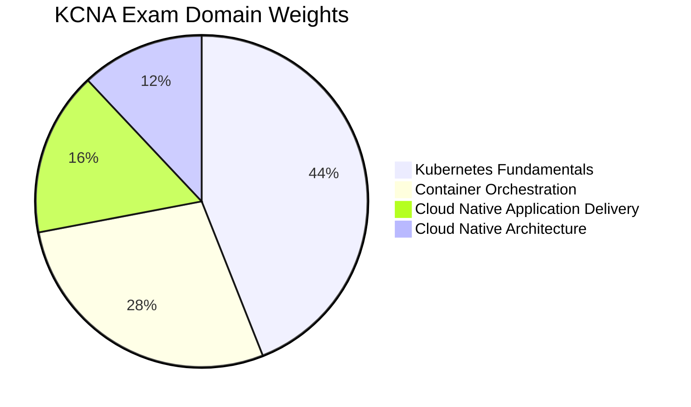

# KCNA - Kubernetes and Cloud Native Associate

The **Kubernetes and Cloud Native Associate (KCNA)** is an entry-level certification from the CNCF that validates foundational knowledge of Kubernetes and the cloud native ecosystem. It is an ideal starting point for the Kubestronaut certification path, as it builds the conceptual foundation needed for the hands-on CKA, CKAD, and CKS exams.

## Exam Details

| Detail | Value |
|---|---|
| **Format** | Multiple Choice |
| **Duration** | 90 minutes |
| **Questions** | ~60 |
| **Passing Score** | 75% |
| **Cost** | $250 |
| **Validity** | 2 years |
| **Prerequisites** | None |
| **Delivery** | Online proctored (PSI Secure Browser) |

!!! tip "Exam Tip"
    Unlike the CKA/CKAD/CKS performance-based exams, the KCNA is purely multiple-choice. You do not need a terminal or hands-on Kubernetes access. Focus on understanding concepts, terminology, and architectural relationships rather than memorizing kubectl commands.

## Domain Breakdown

| Domain | Weight |
|---|---|
| [Kubernetes Fundamentals](kubernetes-fundamentals.md) | 44% |
| [Container Orchestration](container-orchestration.md) | 28% |
| [Cloud Native Application Delivery](cloud-native-delivery.md) | 16% |
| [Cloud Native Architecture](cloud-native-architecture.md) | 12% |
| **Total** | **100%** |

!!! tip "Exam Tip"
    Nearly half the exam (44%) covers Kubernetes Fundamentals. Invest the majority of your study time there. Combined with Container Orchestration (28%), these two domains account for 72% of the exam.

## Key Resources

### Official Resources

| Resource | Description |
|---|---|
| [KCNA Curriculum (PDF)](https://github.com/cncf/curriculum) | Official exam curriculum maintained by CNCF |
| [KCNA Certification Page](https://training.linuxfoundation.org/certification/kubernetes-cloud-native-associate/) | Registration, handbook, and exam policies |
| [Kubernetes Documentation](https://kubernetes.io/docs/) | Official Kubernetes docs |
| [CNCF Landscape](https://landscape.cncf.io/) | Interactive map of the cloud native ecosystem |

### Courses

| Course | Platform |
|---|---|
| Kubernetes for the Absolute Beginners | KodeKloud / Udemy |
| Introduction to Kubernetes (LFS158x) | edX (free) |
| Kubernetes and Cloud Native Essentials (LFS250) | Linux Foundation |

### Community Resources

| Resource | Description |
|---|---|
| [walidshaari/Kubernetes-and-Cloud-Native-Associate](https://github.com/walidshaari/Kubernetes-and-Cloud-Native-Associate) | Curated KCNA study resources |
| [edithturn/KCNA-training](https://github.com/edithturn/KCNA-training) | KCNA study notes |
| [DevOpsCube KCNA Study Guide](https://devopscube.com/kcna-study-guide/) | Blog-style study guide |
