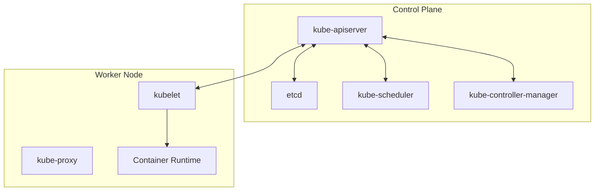

# Kubernetes Fundamentals (44%)

This is the largest domain of the KCNA exam, covering nearly half of all questions. You need a solid understanding of Kubernetes architecture, core resources, the Pod lifecycle, and basic kubectl usage. This domain tests whether you understand **how** Kubernetes works and **why** it is designed the way it is.

!!! tip "Exam Tip"
    You do not need to memorize YAML manifests for the KCNA, but you should be able to recognize correct resource definitions and understand the relationships between Kubernetes objects.

## Kubernetes Architecture

### Control Plane Components

The control plane makes global decisions about the cluster (e.g., scheduling) and detects and responds to cluster events. It consists of the following components:

- **kube-apiserver** -- The front-end of the Kubernetes control plane. All communication (internal and external) goes through the API server. It exposes the Kubernetes API via RESTful endpoints and is the only component that talks directly to etcd.

- **etcd** -- A consistent and highly available key-value store used as the backing store for all cluster data. Every piece of cluster state (Pods, Services, ConfigMaps, Secrets, etc.) is persisted in etcd.

- **kube-scheduler** -- Watches for newly created Pods that have no node assigned and selects a node for them to run on. Scheduling decisions consider resource requirements, affinity/anti-affinity rules, taints and tolerations, and data locality.

- **kube-controller-manager** -- Runs controller processes. Each controller is a separate process logically, but they are compiled into a single binary. Examples include the Node Controller, ReplicaSet Controller, Deployment Controller, and Job Controller.

- **cloud-controller-manager** -- Embeds cloud-specific control logic. It lets you link your cluster into your cloud provider's API. Only relevant when running on a cloud provider (e.g., managing load balancers, routes, and volumes).

### Node Components

Node components run on every node in the cluster and maintain running Pods.

- **kubelet** -- An agent that runs on each node. It ensures containers described in PodSpecs are running and healthy. The kubelet does not manage containers that were not created by Kubernetes.

- **kube-proxy** -- A network proxy running on each node. It maintains network rules that allow network communication to Pods from inside or outside the cluster. It implements the Kubernetes Service concept using iptables, IPVS, or nftables rules.

- **Container Runtime** -- The software responsible for running containers. Kubernetes supports any runtime that implements the Container Runtime Interface (CRI), such as containerd and CRI-O.

### Cluster Communication

- All component-to-API-server communication uses TLS.
- The API server is the central hub -- no other component communicates with etcd directly.
- Kubelet communicates with the API server to receive PodSpecs and report node/pod status.
- kube-proxy watches the API server for Service and Endpoint changes.

## Core Resources

### Pods

A Pod is the smallest deployable unit in Kubernetes. It represents a single instance of a running process and can contain one or more containers that share networking and storage.

- All containers in a Pod share the same IP address and port space.
- Containers in a Pod can communicate via `localhost`.
- Pods are ephemeral -- they are not designed to be long-lived. If a Pod dies, it is not resurrected; a controller creates a new one.

### ReplicaSets

A ReplicaSet ensures that a specified number of Pod replicas are running at any given time. It uses label selectors to identify the Pods it manages.

- ReplicaSets are rarely created directly. Deployments manage ReplicaSets automatically.
- If a Pod managed by a ReplicaSet is deleted or fails, the ReplicaSet creates a replacement.

### Deployments

A Deployment provides declarative updates for Pods and ReplicaSets. It is the most common way to run stateless applications.

- Supports rolling updates and rollbacks.
- Manages ReplicaSets under the hood.
- You declare the desired state, and the Deployment controller changes the actual state to match.

### Services

A Service is an abstraction that defines a logical set of Pods and a policy to access them. Services provide stable networking for ephemeral Pods.

- **ClusterIP** (default) -- Exposes the Service on an internal cluster IP. Only reachable from within the cluster.
- **NodePort** -- Exposes the Service on each node's IP at a static port. Accessible from outside the cluster.
- **LoadBalancer** -- Exposes the Service externally using a cloud provider's load balancer.
- **ExternalName** -- Maps a Service to a DNS name (CNAME record).

### Namespaces

Namespaces provide a mechanism for isolating groups of resources within a single cluster. They are intended for environments with many users across multiple teams or projects.

- Default namespaces: `default`, `kube-system`, `kube-public`, `kube-node-lease`.
- Resource names must be unique within a namespace but not across namespaces.
- Not all Kubernetes resources are namespaced (e.g., Nodes and PersistentVolumes are cluster-scoped).

## Pod Lifecycle

Pods go through several phases during their lifetime:

| Phase | Description |
|---|---|
| **Pending** | Pod accepted by the cluster, but one or more containers have not been set up yet |
| **Running** | Pod bound to a node and all containers created; at least one is running |
| **Succeeded** | All containers terminated successfully and will not be restarted |
| **Failed** | All containers terminated and at least one terminated with a non-zero exit code |
| **Unknown** | Pod state cannot be determined (usually a node communication failure) |

### Probes

Kubernetes uses probes to check the health and readiness of containers:

- **Liveness Probe** -- Determines if a container is running. If it fails, the kubelet kills the container and applies the restart policy.
- **Readiness Probe** -- Determines if a container is ready to receive traffic. If it fails, the Pod's IP is removed from Service endpoints.
- **Startup Probe** -- Determines if a container has started successfully. Disables liveness and readiness checks until it succeeds (useful for slow-starting containers).

## kubectl Basics

`kubectl` is the command-line tool for interacting with the Kubernetes API. Key commands for the KCNA:

| Command | Purpose |
|---|---|
| `kubectl get <resource>` | List resources |
| `kubectl describe <resource> <name>` | Show detailed information |
| `kubectl create -f <file>` | Create resource from a file |
| `kubectl apply -f <file>` | Apply a configuration (create or update) |
| `kubectl delete <resource> <name>` | Delete a resource |
| `kubectl logs <pod>` | Print container logs |
| `kubectl exec -it <pod> -- <cmd>` | Execute a command in a container |
| `kubectl explain <resource>` | Show documentation for a resource |

!!! tip "Exam Tip"
    For the KCNA you do not need to type kubectl commands, but you should understand the difference between imperative (`kubectl create`) and declarative (`kubectl apply`) approaches. Declarative management is the recommended Kubernetes pattern.

## Important Links

- [Kubernetes Components](https://kubernetes.io/docs/concepts/overview/components/)
- [Pods](https://kubernetes.io/docs/concepts/workloads/pods/)
- [Deployments](https://kubernetes.io/docs/concepts/workloads/controllers/deployment/)
- [Services](https://kubernetes.io/docs/concepts/services-networking/service/)
- [Namespaces](https://kubernetes.io/docs/concepts/overview/working-with-objects/namespaces/)
- [Pod Lifecycle](https://kubernetes.io/docs/concepts/workloads/pods/pod-lifecycle/)
- [kubectl Cheat Sheet](https://kubernetes.io/docs/reference/kubectl/cheatsheet/)

## Practice Questions

??? question "Which control plane component is responsible for storing all cluster state data?"
    Think about where Kubernetes persists configuration and state information.

    ??? success "Answer"
        **etcd** is the key-value store that serves as the backing store for all cluster data. It is the single source of truth for the cluster's state. Only the kube-apiserver communicates directly with etcd.

??? question "A Pod has three containers. Two have exited successfully (exit code 0) and one has exited with exit code 1. What is the Pod's phase?"
    Consider how Kubernetes determines the overall Pod phase based on individual container statuses.

    ??? success "Answer"
        The Pod phase is **Failed**. A Pod is in the Failed phase when all containers have terminated and at least one container has terminated with a non-zero exit code. Since one container exited with code 1, the Pod is considered Failed.

??? question "What is the difference between a liveness probe and a readiness probe?"
    Consider what happens when each type of probe fails.

    ??? success "Answer"
        A **liveness probe** checks if a container is still running. If it fails, the kubelet kills the container and restarts it according to the Pod's restart policy. A **readiness probe** checks if a container is ready to accept traffic. If it fails, the Pod's IP address is removed from the endpoints of all matching Services, but the container is **not** restarted. Liveness determines "is it alive?" while readiness determines "can it serve requests?"

??? question "Which Service type makes a service accessible from outside the cluster without requiring a cloud provider?"
    Consider the different Service types and their accessibility scope.

    ??? success "Answer"
        **NodePort** exposes the Service on each node's IP address at a static port (in the range 30000-32767 by default). External traffic can reach the Service by connecting to any node's IP on the assigned port. Unlike LoadBalancer, it does not require cloud provider integration.

??? question "What happens if you create two Pods with the same name in different namespaces?"
    Think about the scope of resource names in Kubernetes.

    ??? success "Answer"
        Both Pods will be created successfully. Resource names must be unique **within a namespace**, but the same name can be reused across different namespaces. This is one of the key purposes of namespaces -- providing scope for resource names.
