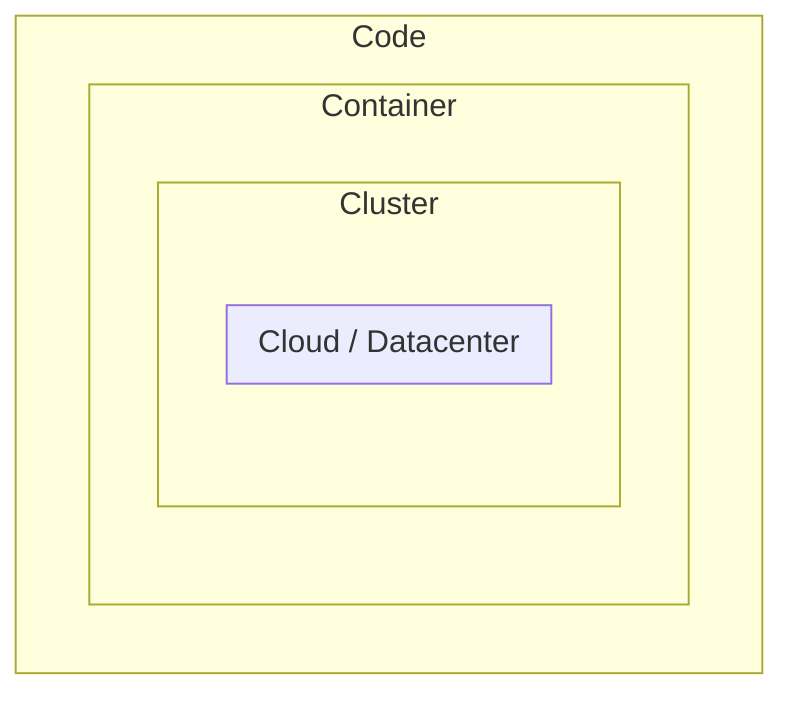

# Overview of Cloud Native Security (14%)

This domain covers the foundational security concepts that underpin the entire cloud native ecosystem. You need to understand how security is layered across different levels, the principles that guide secure system design, and the shared responsibility models used in cloud environments.

## The 4Cs of Cloud Native Security

The **4Cs model** is the foundational framework for understanding cloud native security. Each layer builds upon the security of the layer beneath it, and weaknesses at any level compromise the security of all layers above.

### Cloud (Infrastructure) Security

The outermost layer. Security of the underlying infrastructure — whether a public cloud provider, private datacenter, or hybrid environment.

- Physical security of servers and networks
- IAM (Identity and Access Management) policies
- Network perimeter controls (firewalls, VPCs, security groups)
- Encryption of data at rest and in transit
- Provider-level compliance certifications (SOC 2, ISO 27001)

### Cluster Security

Security of the Kubernetes cluster itself, including the control plane and worker nodes.

- API server authentication and authorization
- RBAC configuration
- Network policies
- etcd encryption
- Admission controllers
- Node security and hardening

### Container Security

Security of the container runtime and the container images being deployed.

- Minimal base images (distroless, scratch)
- Image vulnerability scanning
- Running containers as non-root
- Read-only root filesystems
- Resource limits and quotas
- Container runtime security (seccomp, AppArmor, SELinux)

### Code Security

The innermost layer. Security of the application code itself.

- Static Application Security Testing (SAST)
- Dynamic Application Security Testing (DAST)
- Dependency scanning and Software Composition Analysis (SCA)
- Secrets management (avoid hardcoded credentials)
- Input validation and output encoding
- TLS for all service-to-service communication

!!! tip "Exam Tip"
    Know the 4Cs model thoroughly. The exam frequently tests your understanding of which security controls belong to which layer and how weaknesses in an outer layer affect inner layers.

## Defense in Depth

**Defense in depth** is a security strategy that employs multiple layers of defense mechanisms. If one layer is breached, additional layers continue to protect the system.

Key principles:

- **Layered security** — Apply security controls at every layer (network, host, container, application)
- **Redundancy** — Do not rely on a single security mechanism
- **Diversity** — Use different types of controls (preventive, detective, corrective)
- **Fail securely** — Systems should default to a secure state when failures occur

In a Kubernetes context, defense in depth means combining:

- Network segmentation with NetworkPolicies
- Pod Security Standards to restrict container capabilities
- RBAC to limit user and service account permissions
- Runtime security monitoring with tools like Falco
- Image scanning before deployment
- Audit logging for forensic analysis

## Zero Trust Security

**Zero Trust** operates on the principle of "never trust, always verify." No entity — whether inside or outside the network perimeter — is trusted by default.

Core tenets of Zero Trust:

- **Verify explicitly** — Always authenticate and authorize based on all available data points (identity, location, device, service)
- **Least privilege access** — Limit access to the minimum necessary for a task
- **Assume breach** — Design systems assuming attackers are already present in the network

Zero Trust in Kubernetes:

| Principle | Kubernetes Implementation |
|---|---|
| Verify explicitly | Mutual TLS (mTLS) between services via service mesh |
| Least privilege | RBAC, Pod Security Standards, minimal ServiceAccount permissions |
| Assume breach | Network segmentation, audit logging, runtime detection |
| Micro-segmentation | NetworkPolicies to restrict pod-to-pod traffic |
| Identity-based access | ServiceAccounts, OIDC integration, short-lived tokens |

## Shared Responsibility Model

In cloud environments, security responsibilities are shared between the cloud provider and the customer. The exact division depends on the service model.

| Responsibility | IaaS | PaaS (Managed K8s) | SaaS |
|---|---|---|---|
| Physical infrastructure | Provider | Provider | Provider |
| Network controls | Shared | Provider | Provider |
| OS patching | Customer | Provider | Provider |
| Control plane | Customer | Provider | Provider |
| Worker node security | Customer | Shared | Provider |
| Container/workload security | Customer | Customer | Provider |
| Application security | Customer | Customer | Shared |
| Data security | Customer | Customer | Customer |
| Identity & access management | Customer | Customer | Customer |

!!! info "Managed Kubernetes"
    With managed Kubernetes services (EKS, AKS, GKE), the provider manages the control plane (API server, etcd, scheduler, controller manager). The customer is responsible for workload security, RBAC, network policies, pod security, and application-level controls.

## Security Principles

### Least Privilege

Grant only the minimum permissions required for a task. In Kubernetes:

- Use specific RBAC roles instead of `cluster-admin`
- Restrict ServiceAccount permissions
- Drop all container capabilities and add only what is needed
- Use Pod Security Standards at `restricted` level

### Separation of Duties

No single user or process should have enough access to compromise the entire system alone.

- Separate cluster-admin from namespace-admin roles
- Use different ServiceAccounts for different workloads
- Isolate sensitive workloads in dedicated namespaces

### Immutability

Containers should be immutable once deployed. Never modify running containers; instead, build new images and redeploy.

- Use read-only root filesystems
- Avoid exec-ing into production containers
- Implement GitOps workflows for declarative deployments

## Important Links

- [The 4C's of Cloud Native Security](https://kubernetes.io/docs/concepts/security/overview/)
- [Kubernetes Security Documentation](https://kubernetes.io/docs/concepts/security/)
- [CNCF Cloud Native Security Whitepaper](https://github.com/cncf/tag-security/blob/main/security-whitepaper/v2/cloud-native-security-whitepaper.md)
- [NIST Zero Trust Architecture (SP 800-207)](https://csrc.nist.gov/publications/detail/sp/800-207/final)

## Practice Questions

??? question "What are the 4Cs of Cloud Native Security, from outermost to innermost?"
    Name all four layers in the correct order and give one example security control for each.

    ??? success "Answer"
        The 4Cs from outermost to innermost are:

        1. **Cloud** — e.g., IAM policies, network perimeter controls, VPC configuration
        2. **Cluster** — e.g., RBAC, API server authentication, NetworkPolicies
        3. **Container** — e.g., image scanning, running as non-root, read-only filesystems
        4. **Code** — e.g., dependency scanning, secrets management, input validation

        Security at each outer layer is a prerequisite for inner layers. A compromised cloud layer undermines all cluster, container, and code-level controls.

??? question "What is the key difference between defense in depth and zero trust?"
    Explain how these two security strategies differ and how they complement each other.

    ??? success "Answer"
        **Defense in depth** focuses on layering multiple security controls so that the failure of one control does not compromise the system. It is about redundancy and multiple barriers.

        **Zero trust** focuses on eliminating implicit trust. Every request must be authenticated and authorized regardless of its origin (internal or external network). It is about verification and least privilege.

        They complement each other: defense in depth provides the layered controls, while zero trust provides the policy model that governs how those controls make access decisions. In Kubernetes, you apply defense in depth by combining NetworkPolicies, RBAC, Pod Security Standards, and runtime monitoring, while applying zero trust by requiring mTLS, short-lived tokens, and explicit identity verification for every service interaction.

??? question "In a managed Kubernetes service like EKS or GKE, who is responsible for securing etcd?"
    Consider the shared responsibility model for managed Kubernetes.

    ??? success "Answer"
        In a managed Kubernetes service, the **cloud provider** is responsible for securing etcd. The provider manages the entire control plane, including etcd, the API server, the scheduler, and the controller manager. The customer does not have direct access to etcd and cannot configure its encryption or access controls.

        However, the customer is responsible for configuring Kubernetes-level controls that affect what data is stored in etcd (e.g., enabling encryption at rest for Kubernetes Secrets via `EncryptionConfiguration` if the provider supports it, or using external secrets managers).

??? question "Which security principle states that a container should never be modified after deployment?"
    Name the principle and describe how it applies to Kubernetes workloads.

    ??? success "Answer"
        The principle is **immutability**. Once a container image is built and deployed, it should not be modified at runtime. Changes should be made by building a new image version and redeploying.

        In Kubernetes, this is implemented by:

        - Setting `readOnlyRootFilesystem: true` in the SecurityContext
        - Avoiding `kubectl exec` into production containers
        - Using GitOps workflows where the desired state is declared in Git and applied automatically
        - Ensuring containers do not require write access to their filesystem for normal operation

??? question "A team deploys all their services with the default ServiceAccount and cluster-admin privileges. Which security principle does this violate?"
    Identify the violated principle and explain the risks.

    ??? success "Answer"
        This violates the **principle of least privilege**. The default ServiceAccount should have minimal permissions, and cluster-admin grants unrestricted access to all resources in the cluster.

        Risks include:

        - Any compromised pod can access all cluster resources (Secrets, ConfigMaps, other workloads)
        - A container escape could lead to full cluster takeover
        - No blast radius containment — a single vulnerability affects the entire cluster
        - Violates separation of duties as every workload has the same permissions

        The correct approach is to create dedicated ServiceAccounts per workload with only the specific RBAC permissions they need.
