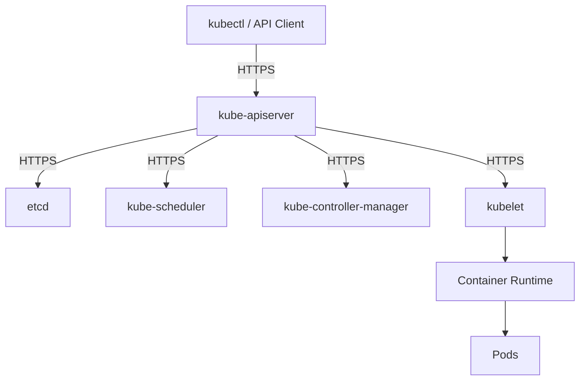
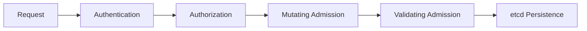

# Kubernetes Cluster Component Security (22%)

This domain focuses on securing the individual components that make up a Kubernetes cluster. Understanding how each control plane and node component works, how they communicate, and how to harden them is critical for the KCSA exam. This is one of the two highest-weighted domains.

## Control Plane Architecture Overview



All control plane communication should be encrypted with TLS and authenticated using client certificates or tokens.

!!! tip "Exam Tip"
    The API server is the central hub — all other components communicate through it. Understand that no component talks directly to another; everything goes through the API server (with the exception of etcd, which is accessed only by the API server).

## API Server Security

The **kube-apiserver** is the front door to the cluster. Every request — from `kubectl`, controllers, kubelets, and external systems — passes through the API server. Securing it is the single most important step in cluster hardening.

### Authentication

Authentication determines **who** is making a request. Kubernetes supports multiple authentication mechanisms that can be used simultaneously.

| Method | Description | Use Case |
|---|---|---|
| X.509 Client Certificates | TLS client certs signed by cluster CA | Component-to-component, admin users |
| Bearer Tokens | Static tokens or ServiceAccount tokens | ServiceAccounts, legacy setups |
| OIDC (OpenID Connect) | External identity provider integration | Enterprise SSO, human users |
| Webhook Token Authentication | External service validates tokens | Custom authentication backends |
| Bootstrap Tokens | Short-lived tokens for node bootstrapping | `kubeadm join` operations |

!!! warning "Avoid Static Tokens"
    Static token files (`--token-auth-file`) and static password files (`--basic-auth-file`) are insecure and deprecated. Use X.509 certificates or OIDC for human users and bound ServiceAccount tokens for workloads.

### Authorization

Authorization determines **what** an authenticated user can do. Kubernetes evaluates authorization modules in order and uses the first decision (allow or deny).

| Mode | Description |
|---|---|
| **RBAC** | Role-Based Access Control — the recommended and most common mode |
| **ABAC** | Attribute-Based Access Control — legacy, uses static policy files |
| **Node** | Special-purpose authorizer for kubelet requests |
| **Webhook** | Delegates decisions to an external service |

The recommended API server configuration uses `--authorization-mode=Node,RBAC`.

### Admission Control

**Admission controllers** intercept requests to the API server after authentication and authorization but before the object is persisted to etcd. They can **validate** (accept/reject) or **mutate** (modify) requests.

Important built-in admission controllers:

| Controller | Purpose |
|---|---|
| `PodSecurity` | Enforces Pod Security Standards (Privileged/Baseline/Restricted) |
| `NodeRestriction` | Limits kubelet API access to its own Node and Pod objects |
| `LimitRanger` | Enforces default resource limits per namespace |
| `ResourceQuota` | Enforces resource quotas per namespace |
| `ServiceAccount` | Automatically mounts ServiceAccount tokens |
| `DefaultStorageClass` | Assigns default StorageClass to PVCs |

**Dynamic admission controllers** use webhooks:

- **ValidatingAdmissionWebhook** — Validates requests against external policies (e.g., OPA/Gatekeeper, Kyverno)
- **MutatingAdmissionWebhook** — Modifies requests before persistence (e.g., injecting sidecars)



!!! tip "Exam Tip"
    Know the order of the API request flow: Authentication --> Authorization --> Mutating Admission --> Schema Validation --> Validating Admission --> Persistence to etcd.

### API Server Hardening Flags

Key API server flags for security:

| Flag | Purpose |
|---|---|
| `--anonymous-auth=false` | Disables anonymous requests |
| `--authorization-mode=Node,RBAC` | Enables Node and RBAC authorization |
| `--enable-admission-plugins=...` | Enables specific admission controllers |
| `--audit-log-path` | Enables audit logging to a file |
| `--audit-policy-file` | Defines audit policy rules |
| `--encryption-provider-config` | Enables encryption at rest for Secrets |
| `--tls-cert-file`, `--tls-private-key-file` | TLS serving certificates |
| `--client-ca-file` | CA for verifying client certificates |
| `--kubelet-certificate-authority` | CA for verifying kubelet serving certs |
| `--insecure-port=0` | Disables the insecure HTTP port (deprecated and removed in 1.24+) |
| `--profiling=false` | Disables profiling endpoint |

## etcd Security

**etcd** is the distributed key-value store that holds all cluster state, including Secrets, ConfigMaps, RBAC policies, and workload definitions. Compromising etcd means full cluster compromise.

### Encryption at Rest

By default, data in etcd is stored **unencrypted**. Kubernetes supports encryption at rest using an `EncryptionConfiguration` resource.

```yaml
apiVersion: apiserver.config.k8s.io/v1
kind: EncryptionConfiguration
resources:
  - resources:
      - secrets
    providers:
      - aescbc:
          keys:
            - name: key1
              secret: <base64-encoded-key>
      - identity: {}
```

Supported encryption providers (ordered by recommendation):

1. **KMS (Key Management Service)** — Recommended for production. Uses an external KMS (e.g., AWS KMS, Azure Key Vault, HashiCorp Vault)
2. **aescbc** — AES-CBC encryption with PKCS#7 padding
3. **aesgcm** — AES-GCM encryption (must rotate keys frequently)
4. **secretbox** — Uses XSalsa20 and Poly1305
5. **identity** — No encryption (plaintext, the default)

### etcd Access Control

- etcd should only be accessible by the API server
- Use mutual TLS (mTLS) for all etcd communication
- Key flags: `--etcd-certfile`, `--etcd-keyfile`, `--etcd-cafile`
- Restrict network access to etcd ports (2379/2380) using firewall rules
- Run etcd on dedicated nodes when possible
- Regularly back up etcd with `etcdctl snapshot save`

!!! warning "Critical"
    Direct access to etcd bypasses all Kubernetes authentication, authorization, and admission controls. Anyone with etcd access has full read/write access to the entire cluster state.

## Kubelet Security

The **kubelet** is the primary node agent responsible for managing pods on each worker node. It exposes an HTTPS API that must be secured.

### Kubelet Authentication and Authorization

| Configuration | Recommended Value | Purpose |
|---|---|---|
| `authentication.anonymous.enabled` | `false` | Disables anonymous access to kubelet API |
| `authentication.webhook.enabled` | `true` | Authenticates kubelet API requests via API server |
| `authorization.mode` | `Webhook` | Authorizes kubelet API requests via API server |
| `readOnlyPort` | `0` | Disables the unauthenticated read-only port (10255) |
| `protectKernelDefaults` | `true` | Ensures required kernel parameters are set |
| `rotateCertificates` | `true` | Enables automatic certificate rotation |

### NodeRestriction Admission Controller

The `NodeRestriction` admission controller limits what kubelets can modify via the API server:

- Kubelets can only modify their own Node object
- Kubelets can only modify Pod objects bound to their node
- Kubelets cannot modify labels with the `node-restriction.kubernetes.io/` prefix
- Prevents a compromised node from affecting other nodes

## Scheduler Security

The **kube-scheduler** assigns pods to nodes. Security considerations:

- Uses a kubeconfig file or client certificates to authenticate to the API server
- Runs with a dedicated ServiceAccount with minimal permissions
- Bind to `127.0.0.1` for the health/metrics endpoint (`--bind-address=127.0.0.1`)
- Disable profiling (`--profiling=false`)
- The secure port should use TLS (`--secure-port`)

## Controller Manager Security

The **kube-controller-manager** runs control loops that reconcile cluster state. It has elevated privileges because controllers need to manage many resource types.

Security considerations:

- Authenticate to the API server via kubeconfig with a dedicated ServiceAccount
- Use `--use-service-account-credentials=true` — each controller uses its own ServiceAccount instead of sharing the controller manager's credentials
- Bind health/metrics to localhost (`--bind-address=127.0.0.1`)
- Disable profiling (`--profiling=false`)
- Manages the signing key for ServiceAccount tokens (`--service-account-private-key-file`)
- Set `--root-ca-file` so that issued tokens include the cluster CA

## Securing Control Plane Communication

All communication between control plane components and between the control plane and nodes should be secured with TLS.

| Communication Path | Encryption | Authentication |
|---|---|---|
| kubectl --> API Server | TLS | Client certificates or bearer tokens |
| API Server --> etcd | Mutual TLS | Client certificates |
| API Server --> Kubelet | TLS | Client certificates |
| Kubelet --> API Server | TLS | Bootstrap tokens, then client certificates |
| Scheduler --> API Server | TLS | Client certificates or kubeconfig |
| Controller Manager --> API Server | TLS | Client certificates or kubeconfig |
| kube-proxy --> API Server | TLS | kubeconfig |

### Certificate Management

Kubernetes uses a PKI (Public Key Infrastructure) with a cluster CA:

- All components present certificates signed by the cluster CA
- `kubeadm` automatically generates and distributes certificates
- Certificates have expiration dates and must be rotated (`kubeadm certs renew`)
- Store CA private keys securely (ideally offline or in an HSM for production)

## Important Links

- [Securing a Cluster](https://kubernetes.io/docs/tasks/administer-cluster/securing-a-cluster/)
- [Controlling Access to the Kubernetes API](https://kubernetes.io/docs/concepts/security/controlling-access/)
- [Encrypting Confidential Data at Rest](https://kubernetes.io/docs/tasks/administer-cluster/encrypt-data/)
- [Kubelet Authentication/Authorization](https://kubernetes.io/docs/reference/access-authn-authz/kubelet-authn-authz/)
- [Admission Controllers Reference](https://kubernetes.io/docs/reference/access-authn-authz/admission-controllers/)
- [PKI Certificates and Requirements](https://kubernetes.io/docs/setup/best-practices/certificates/)
- [etcd Security Model](https://etcd.io/docs/v3.5/op-guide/security/)

## Practice Questions

??? question "A request to create a Pod passes authentication and RBAC authorization but is rejected. What could cause this?"
    Consider all stages a request passes through before being persisted.

    ??? success "Answer"
        The request was likely rejected by an **admission controller**. After authentication and authorization, requests pass through mutating admission webhooks, schema validation, and then validating admission webhooks before being written to etcd.

        Common reasons for admission controller rejection:

        - **PodSecurity** admission rejects pods that violate the namespace's Pod Security Standard (e.g., running as root in a `restricted` namespace)
        - **ResourceQuota** rejects pods that would exceed the namespace's resource quota
        - **LimitRanger** rejects pods without resource requests/limits when the namespace requires them
        - A **ValidatingAdmissionWebhook** (OPA/Gatekeeper, Kyverno) rejects the pod based on a custom policy

??? question "Why is encrypting etcd at rest important even if the cluster network is secured with TLS?"
    Consider what TLS protects versus what encryption at rest protects.

    ??? success "Answer"
        TLS protects data **in transit** — it ensures that communication between the API server and etcd cannot be intercepted. However, TLS does not protect data **at rest** on disk.

        Without encryption at rest, anyone with access to the etcd data directory (e.g., via a backup, a compromised node, or physical access to the disk) can read all cluster data in plaintext, including Kubernetes Secrets (which contain passwords, API keys, TLS certificates).

        Encryption at rest ensures that even if the underlying storage is compromised, the data remains encrypted and unreadable without the encryption keys.

??? question "What is the purpose of the NodeRestriction admission controller?"
    Explain what it restricts and why this is important.

    ??? success "Answer"
        The **NodeRestriction** admission controller limits what a kubelet can modify via the API server:

        - A kubelet can only modify its **own** Node object
        - A kubelet can only modify Pod objects that are **scheduled to its node**
        - A kubelet cannot set labels with the `node-restriction.kubernetes.io/` prefix

        This is important because if a worker node is compromised, the attacker (using the node's kubelet credentials) is limited to affecting only that node's resources. Without NodeRestriction, a compromised kubelet could modify other nodes or pods, potentially escalating the attack to the entire cluster.

??? question "What is the difference between a MutatingAdmissionWebhook and a ValidatingAdmissionWebhook?"
    Describe when each is called and what each can do.

    ??? success "Answer"
        **MutatingAdmissionWebhook** is called first and can **modify** (mutate) the incoming request object. Common use cases include:

        - Injecting sidecar containers (e.g., Istio envoy proxy)
        - Adding default labels or annotations
        - Setting default resource limits

        **ValidatingAdmissionWebhook** is called after mutation and can only **accept or reject** the request — it cannot modify it. Common use cases include:

        - Enforcing security policies (OPA/Gatekeeper, Kyverno)
        - Ensuring required labels are present
        - Blocking images from untrusted registries

        The order is: Mutating --> Schema Validation --> Validating. This ensures validators see the final mutated form of the object.

??? question "Which kubelet configuration settings should be changed from their defaults to improve security?"
    List at least four settings and their recommended values.

    ??? success "Answer"
        Key kubelet security settings:

        1. **`authentication.anonymous.enabled: false`** — Disable anonymous authentication to the kubelet API (default is `true` in some configurations)
        2. **`authentication.webhook.enabled: true`** — Use the API server to authenticate requests to the kubelet
        3. **`authorization.mode: Webhook`** — Use the API server for authorization instead of `AlwaysAllow`
        4. **`readOnlyPort: 0`** — Disable the unauthenticated read-only port 10255 (default may be 10255)
        5. **`rotateCertificates: true`** — Enable automatic rotation of kubelet client and serving certificates
        6. **`protectKernelDefaults: true`** — Ensure sysctl values required by the kubelet are properly set

        These settings prevent unauthorized access to the kubelet API, which could be used to execute commands in containers, read logs, or exfiltrate data.
