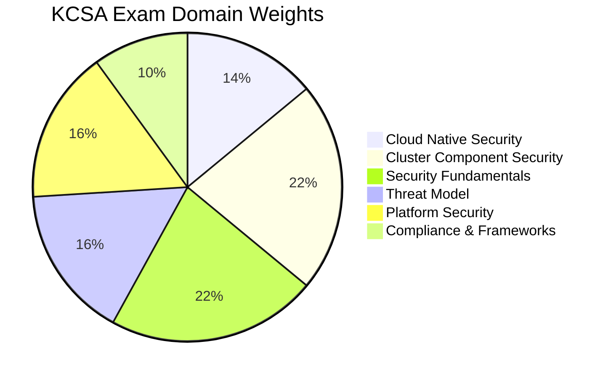

# KCSA - Kubernetes and Cloud Native Security Associate

The **Kubernetes and Cloud Native Security Associate (KCSA)** exam demonstrates a candidate's foundational knowledge of security concepts and best practices in Kubernetes and the broader cloud native ecosystem. It covers topics ranging from cluster hardening and threat modeling to compliance frameworks and supply chain security.

## Exam Details

| Detail | Information |
|---|---|
| **Format** | Multiple Choice |
| **Duration** | 90 minutes |
| **Questions** | ~60 |
| **Passing Score** | 75% |
| **Cost** | $250 |
| **Validity** | 2 years |
| **Prerequisites** | None (KCNA recommended) |
| **Exam Platform** | PSI Online Proctoring |
| **Registration** | [Linux Foundation Training Portal](https://training.linuxfoundation.org/certification/kubernetes-and-cloud-native-security-associate-kcsa/) |

!!! tip "Exam Tip"
    Unlike performance-based exams (CKA, CKAD, CKS), the KCSA is a multiple-choice exam. Focus on understanding concepts, architectures, and security principles rather than memorizing commands. You do **not** have access to Kubernetes documentation during the exam.

## Domain Breakdown

| Domain | Weight |
|---|---|
| [Overview of Cloud Native Security](cloud-native-security.md) | 14% |
| [Kubernetes Cluster Component Security](cluster-component-security.md) | 22% |
| [Kubernetes Security Fundamentals](security-fundamentals.md) | 22% |
| [Kubernetes Threat Model](threat-model.md) | 16% |
| [Platform Security](platform-security.md) | 16% |
| [Compliance and Security Frameworks](compliance.md) | 10% |

!!! info "Focus Areas"
    **Kubernetes Cluster Component Security** and **Kubernetes Security Fundamentals** together account for **44%** of the exam. Prioritize these two domains in your study plan.

## Key Resources

| Resource | Description |
|---|---|
| [KCSA Curriculum (PDF)](https://github.com/cncf/curriculum) | Official CNCF exam curriculum |
| [Kubernetes Security Docs](https://kubernetes.io/docs/concepts/security/) | Official Kubernetes security documentation |
| [KCSA Registration](https://training.linuxfoundation.org/certification/kubernetes-and-cloud-native-security-associate-kcsa/) | Register for the KCSA exam |
| [KCSA Mock Exam (290+ questions)](https://github.com/thiago4go/kubernetes-security-kcsa-mock) | Interactive mock exam in the browser |
| [KCSA Mock Questions (150)](https://github.com/yongkanghe/kcsa) | Additional practice questions |
| [DevOpsCube KCSA Study Guide](https://devopscube.com/kcsa-exam-study-guide/) | Community study guide with exam tips |
| [Paul Yu's KCSA Study Guide](https://paulyu.dev/article/kcsa-study-guide/) | Detailed walkthrough of all domains |
| [KodeKloud KCSA Course](https://kodekloud.com/) | Video course with practice labs |
