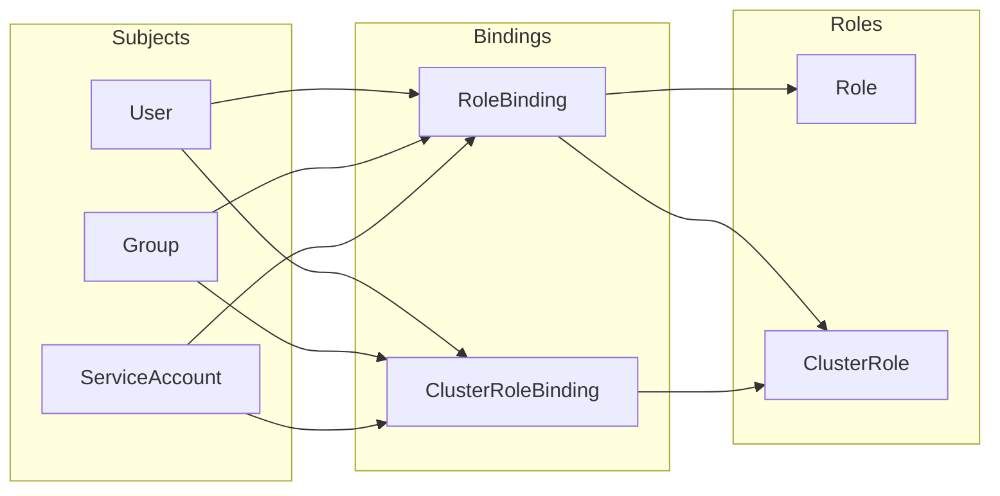

# Kubernetes Security Fundamentals (22%)

This domain covers the core Kubernetes-native security mechanisms that are used daily to secure workloads and cluster access. Together with Cluster Component Security, this domain accounts for nearly half the exam. Mastering RBAC, Pod Security Standards, NetworkPolicies, Secrets, and SecurityContext is essential.

## RBAC (Role-Based Access Control)

RBAC is the standard authorization mechanism in Kubernetes. It controls **who** (subject) can perform **what** (verbs) on **which resources** (objects) in **which scope** (namespace or cluster).

### RBAC Building Blocks



| Resource | Scope | Description |
|---|---|---|
| **Role** | Namespace | Defines permissions within a single namespace |
| **ClusterRole** | Cluster-wide | Defines permissions across all namespaces or for cluster-scoped resources |
| **RoleBinding** | Namespace | Binds a Role or ClusterRole to subjects in a specific namespace |
| **ClusterRoleBinding** | Cluster-wide | Binds a ClusterRole to subjects across the entire cluster |

### Role Example

```yaml
apiVersion: rbac.authorization.k8s.io/v1
kind: Role
metadata:
  namespace: production
  name: pod-reader
rules:
  - apiGroups: [""]
    resources: ["pods"]
    verbs: ["get", "watch", "list"]
```

### ClusterRole Example

```yaml
apiVersion: rbac.authorization.k8s.io/v1
kind: ClusterRole
metadata:
  name: node-reader
rules:
  - apiGroups: [""]
    resources: ["nodes"]
    verbs: ["get", "watch", "list"]
```

### RoleBinding Example

```yaml
apiVersion: rbac.authorization.k8s.io/v1
kind: RoleBinding
metadata:
  name: read-pods
  namespace: production
subjects:
  - kind: User
    name: jane
    apiGroup: rbac.authorization.k8s.io
roleRef:
  kind: Role
  name: pod-reader
  apiGroup: rbac.authorization.k8s.io
```

### Key RBAC Concepts

- **Additive only** — RBAC only grants permissions; there are no deny rules
- **Least privilege** — Always grant the minimum permissions necessary
- **Aggregated ClusterRoles** — Combine multiple ClusterRoles using label selectors
- **Default ClusterRoles** — `cluster-admin`, `admin`, `edit`, `view` are built-in
- A **ClusterRole** bound via a **RoleBinding** is scoped to that namespace
- A **ClusterRole** bound via a **ClusterRoleBinding** applies cluster-wide

!!! tip "Exam Tip"
    Understand the difference between binding a ClusterRole with a RoleBinding (namespace-scoped) versus a ClusterRoleBinding (cluster-wide). A common pattern is to define a ClusterRole once and reuse it in multiple namespaces via RoleBindings.

### Verifying RBAC Permissions

```bash
# Check if a user can perform an action
kubectl auth can-i create deployments --namespace production --as jane

# Check all permissions for a user
kubectl auth can-i --list --as jane --namespace production
```

## Pod Security Standards

**Pod Security Standards** define three progressively restrictive security profiles that determine which security-sensitive fields are allowed in pod specifications.

| Level | Description | Use Case |
|---|---|---|
| **Privileged** | Unrestricted; allows all pod configurations | System-wide infrastructure (CNI, storage drivers) |
| **Baseline** | Prevents known privilege escalations; minimally restrictive | Standard workloads with reasonable defaults |
| **Restricted** | Heavily restricted; follows security best practices | Security-critical or untrusted workloads |

### Key Restrictions by Level

| Security Control | Privileged | Baseline | Restricted |
|---|---|---|---|
| Host namespaces (hostPID, hostIPC, hostNetwork) | Allowed | Blocked | Blocked |
| Privileged containers | Allowed | Blocked | Blocked |
| Capabilities beyond default set | Allowed | Blocked | Blocked |
| HostPath volumes | Allowed | Allowed | Blocked |
| Running as root (runAsNonRoot) | Allowed | Allowed | Required `true` |
| Privilege escalation (allowPrivilegeEscalation) | Allowed | Allowed | Required `false` |
| Seccomp profile | Any | Any | Must be `RuntimeDefault` or `Localhost` |
| Drop ALL capabilities | Not required | Not required | Required |

## Pod Security Admission

**Pod Security Admission (PSA)** is the built-in admission controller that enforces Pod Security Standards at the namespace level. It replaced the deprecated PodSecurityPolicy (PSP).

### Modes

| Mode | Behavior |
|---|---|
| **enforce** | Violations are rejected; pods are not created |
| **audit** | Violations are recorded in audit logs but pods are allowed |
| **warn** | Violations trigger warnings to the user but pods are allowed |

### Namespace Labels

Pod Security Admission is configured via namespace labels:

```yaml
apiVersion: v1
kind: Namespace
metadata:
  name: production
  labels:
    pod-security.kubernetes.io/enforce: restricted
    pod-security.kubernetes.io/enforce-version: latest
    pod-security.kubernetes.io/audit: restricted
    pod-security.kubernetes.io/warn: restricted
```

!!! tip "Exam Tip"
    Pod Security Admission uses namespace labels, not separate policy objects. Know all three modes (enforce, audit, warn) and all three levels (privileged, baseline, restricted). A common exam strategy is to set `enforce: baseline` and `warn: restricted` to catch violations without breaking workloads.

## NetworkPolicies

**NetworkPolicies** control network traffic between pods and external endpoints. By default, all pods can communicate with all other pods (flat network). NetworkPolicies allow you to restrict this.

### Default Deny Policy

A best practice is to start with a default deny policy and then explicitly allow required traffic:

```yaml
apiVersion: networking.k8s.io/v1
kind: NetworkPolicy
metadata:
  name: default-deny-all
  namespace: production
spec:
  podSelector: {}
  policyTypes:
    - Ingress
    - Egress
```

### Allow Specific Traffic

```yaml
apiVersion: networking.k8s.io/v1
kind: NetworkPolicy
metadata:
  name: allow-frontend-to-backend
  namespace: production
spec:
  podSelector:
    matchLabels:
      app: backend
  policyTypes:
    - Ingress
  ingress:
    - from:
        - podSelector:
            matchLabels:
              app: frontend
      ports:
        - protocol: TCP
          port: 8080
```

### Key Concepts

- NetworkPolicies are **additive** — if multiple policies select a pod, the union of all rules applies
- An **empty podSelector** `{}` selects all pods in the namespace
- NetworkPolicies are **namespace-scoped**
- **A CNI plugin that supports NetworkPolicies is required** (e.g., Calico, Cilium, Weave Net). Not all CNI plugins support them (e.g., Flannel does not)
- Policy types: `Ingress` (incoming), `Egress` (outgoing), or both
- Selectors: `podSelector`, `namespaceSelector`, `ipBlock`

!!! warning "Important"
    NetworkPolicies have no effect without a CNI plugin that implements them. On clusters using Flannel or basic kubenet, NetworkPolicy resources are accepted by the API server but not enforced.

## Secrets Management

Kubernetes **Secrets** store sensitive data such as passwords, tokens, and TLS certificates. By default, Secrets are stored as base64-encoded values in etcd (not encrypted).

### Secret Types

| Type | Description |
|---|---|
| `Opaque` | Generic key-value data (default) |
| `kubernetes.io/tls` | TLS certificate and key |
| `kubernetes.io/dockerconfigjson` | Container registry credentials |
| `kubernetes.io/service-account-token` | ServiceAccount token (legacy, auto-generated) |
| `kubernetes.io/basic-auth` | Basic authentication credentials |

### Security Best Practices

- **Enable encryption at rest** — Configure `EncryptionConfiguration` to encrypt Secrets in etcd
- **Use external secret stores** — Integrate with HashiCorp Vault, AWS Secrets Manager, or Azure Key Vault using the CSI Secrets Store Driver or External Secrets Operator
- **Restrict RBAC access** — Limit who can `get`, `list`, or `watch` Secrets
- **Avoid environment variables** — Prefer mounting Secrets as volumes (environment variables may be leaked in logs or process listings)
- **Use short-lived tokens** — Bound ServiceAccount tokens (projected volumes) expire automatically

```yaml
# Mount Secret as a volume (preferred)
volumes:
  - name: db-credentials
    secret:
      secretName: db-secret
      defaultMode: 0400
containers:
  - name: app
    volumeMounts:
      - name: db-credentials
        mountPath: /etc/secrets
        readOnly: true
```

!!! tip "Exam Tip"
    Kubernetes Secrets are base64-encoded, not encrypted. Know the difference. Base64 is an encoding (trivially reversible), not encryption. Always enable encryption at rest and consider external secret management for production.

## ServiceAccounts

**ServiceAccounts** provide an identity for processes running in pods. Every pod is associated with a ServiceAccount, which determines the pod's API access permissions.

### Key Concepts

- Every namespace has a `default` ServiceAccount
- The default ServiceAccount should have **no additional permissions**
- Best practice: create a dedicated ServiceAccount per workload
- Since Kubernetes 1.24, ServiceAccount tokens are no longer auto-mounted as persistent Secrets — **bound ServiceAccount tokens** (via projected volumes) are used instead, which are time-limited and audience-bound

### Disabling Auto-Mount

```yaml
apiVersion: v1
kind: ServiceAccount
metadata:
  name: my-app
  namespace: production
automountServiceAccountToken: false
```

Or at the pod level:

```yaml
apiVersion: v1
kind: Pod
metadata:
  name: my-pod
spec:
  serviceAccountName: my-app
  automountServiceAccountToken: false
```

!!! info "Token Changes in 1.24+"
    In Kubernetes 1.24+, the `LegacyServiceAccountTokenNoAutoGeneration` feature ensures that Secret-based tokens are no longer automatically created for ServiceAccounts. Instead, the `TokenRequest` API provides bound, time-limited tokens that are more secure.

## SecurityContext

The **SecurityContext** defines security settings for a pod or individual container. It controls Linux-level security features.

### Pod-Level SecurityContext

```yaml
apiVersion: v1
kind: Pod
metadata:
  name: secure-pod
spec:
  securityContext:
    runAsNonRoot: true
    runAsUser: 1000
    runAsGroup: 3000
    fsGroup: 2000
    seccompProfile:
      type: RuntimeDefault
  containers:
    - name: app
      image: my-app:latest
      securityContext:
        allowPrivilegeEscalation: false
        readOnlyRootFilesystem: true
        capabilities:
          drop:
            - ALL
```

### Key Fields

| Field | Level | Description |
|---|---|---|
| `runAsNonRoot` | Pod/Container | Ensures the container does not run as root (UID 0) |
| `runAsUser` | Pod/Container | Sets the user ID for the container process |
| `runAsGroup` | Pod/Container | Sets the primary group ID |
| `fsGroup` | Pod | Sets the group for all volumes mounted by the pod |
| `readOnlyRootFilesystem` | Container | Prevents writes to the container filesystem |
| `allowPrivilegeEscalation` | Container | Prevents child processes from gaining more privileges |
| `capabilities.drop` | Container | Drops Linux capabilities (use `ALL` to drop everything) |
| `capabilities.add` | Container | Adds specific Linux capabilities |
| `seccompProfile` | Pod/Container | Sets the seccomp profile (`RuntimeDefault`, `Localhost`, `Unconfined`) |
| `seLinuxOptions` | Pod/Container | Sets SELinux context labels |
| `privileged` | Container | Runs container with all host capabilities (avoid in production) |

!!! tip "Exam Tip"
    The `restricted` Pod Security Standard requires: `runAsNonRoot: true`, `allowPrivilegeEscalation: false`, `capabilities.drop: ["ALL"]`, and `seccompProfile.type: RuntimeDefault` (or `Localhost`). Memorize these as the "restricted profile checklist."

## Important Links

- [RBAC Authorization](https://kubernetes.io/docs/reference/access-authn-authz/rbac/)
- [Pod Security Standards](https://kubernetes.io/docs/concepts/security/pod-security-standards/)
- [Pod Security Admission](https://kubernetes.io/docs/concepts/security/pod-security-admission/)
- [Network Policies](https://kubernetes.io/docs/concepts/services-networking/network-policies/)
- [Secrets](https://kubernetes.io/docs/concepts/configuration/secret/)
- [Managing ServiceAccounts](https://kubernetes.io/docs/concepts/security/service-accounts/)
- [Security Context](https://kubernetes.io/docs/tasks/configure-pod-container/security-context/)
- [Good Practices for Kubernetes Secrets](https://kubernetes.io/docs/concepts/security/secrets-good-practices/)

## Practice Questions

??? question "A developer creates a RoleBinding in the 'staging' namespace that references a ClusterRole named 'edit'. What access does the developer get?"
    Consider the scope of the permissions.

    ??? success "Answer"
        The developer gets the permissions defined in the `edit` ClusterRole, but **only within the `staging` namespace**. Even though `edit` is a ClusterRole (and therefore defines permissions for many resource types), the RoleBinding limits its scope to a single namespace.

        This is a common pattern: define permissions once as a ClusterRole and reuse them across multiple namespaces via RoleBindings. The `edit` ClusterRole allows creating, updating, and deleting most resources within the bound namespace (Deployments, Services, ConfigMaps, etc.) but does not grant access to Roles, RoleBindings, or resource quotas.

??? question "What is the difference between Pod Security Standards and Pod Security Admission?"
    Clarify the relationship between these two concepts.

    ??? success "Answer"
        **Pod Security Standards (PSS)** are the three security profiles that define what security settings are permitted in a pod specification:

        - **Privileged** — No restrictions
        - **Baseline** — Blocks known privilege escalations
        - **Restricted** — Full security best practices

        **Pod Security Admission (PSA)** is the **enforcement mechanism** — the built-in admission controller that applies Pod Security Standards at the namespace level. PSA is configured via namespace labels and operates in three modes: `enforce` (reject), `audit` (log), and `warn` (warn user).

        In short: PSS defines the rules, PSA enforces them.

??? question "A NetworkPolicy with an empty podSelector is applied to a namespace. What does it affect?"
    Consider what an empty `podSelector: {}` matches.

    ??? success "Answer"
        An **empty podSelector** `{}` matches **all pods** in the namespace. The effect depends on the policy type:

        - If it specifies `policyTypes: ["Ingress"]` with no `ingress` rules, it **denies all incoming traffic** to all pods in the namespace
        - If it specifies `policyTypes: ["Egress"]` with no `egress` rules, it **denies all outgoing traffic** from all pods in the namespace
        - If both are specified with no rules, it creates a **default deny all** policy

        This is the standard pattern for implementing a "deny by default" network policy. Specific NetworkPolicies are then added to whitelist required traffic flows.

??? question "Why should Kubernetes Secrets be mounted as volumes rather than passed as environment variables?"
    Consider the security implications of each approach.

    ??? success "Answer"
        Mounting Secrets as **volumes** is more secure than using **environment variables** for several reasons:

        1. **Environment variables can leak** — They may appear in `kubectl describe pod` output, container runtime inspect commands, crash dumps, or application error logs
        2. **Environment variables are inherited** — Child processes automatically inherit all environment variables, potentially exposing secrets to unintended processes
        3. **Volume mounts can be restricted** — File permissions (`defaultMode: 0400`) limit which user/group can read the secret
        4. **Volume mounts support updates** — When a Secret is updated, volume-mounted files are updated automatically (after the kubelet sync period), while environment variables require a pod restart
        5. **Read-only access** — Volume mounts can be set to `readOnly: true`

??? question "What security settings are required by the 'restricted' Pod Security Standard?"
    List the mandatory SecurityContext settings.

    ??? success "Answer"
        The **restricted** Pod Security Standard requires:

        - **`runAsNonRoot: true`** — Container must not run as root
        - **`allowPrivilegeEscalation: false`** — No privilege escalation allowed
        - **`capabilities.drop: ["ALL"]`** — All Linux capabilities must be dropped
        - **`seccompProfile.type`** — Must be `RuntimeDefault` or `Localhost`
        - **No hostPath volumes** — Host filesystem mounts are blocked
        - **No host namespaces** — `hostPID`, `hostIPC`, `hostNetwork` must be false
        - **No privileged containers** — `privileged: false`
        - **Container ports must not use host ports**

        Additional allowed capabilities can only include `NET_BIND_SERVICE`. All other capabilities must remain dropped.
