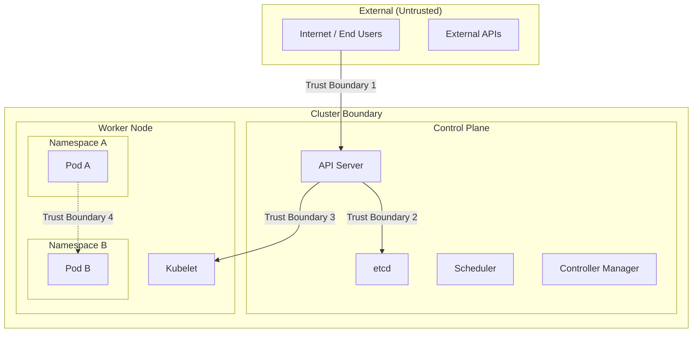
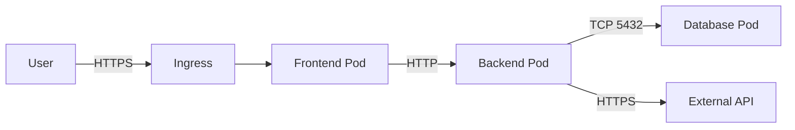

# Kubernetes Threat Model (16%)

This domain covers how to systematically identify, categorize, and mitigate threats in a Kubernetes environment. Understanding trust boundaries, attack surfaces, common attack vectors, and established threat modeling frameworks is essential for the KCSA exam.

## Threat Modeling Methodology

Threat modeling is a structured process for identifying security threats and designing countermeasures. In a Kubernetes context, it involves analyzing the cluster architecture, identifying assets worth protecting, and understanding how attackers could compromise them.

### General Threat Modeling Steps

1. **Identify assets** — What are you protecting? (cluster state, secrets, application data, customer data)
2. **Define trust boundaries** — Where does trust change? (external vs. internal network, namespace boundaries, node boundaries)
3. **Identify threats** — What could go wrong? (use STRIDE, MITRE ATT&CK, or attack trees)
4. **Assess risk** — How likely and impactful is each threat? (probability x impact)
5. **Define mitigations** — What controls reduce or eliminate each threat? (RBAC, network policies, encryption, monitoring)
6. **Validate** — Test that mitigations are effective (penetration testing, security audits, CIS benchmarks)

!!! tip "Exam Tip"
    The exam tests your ability to identify threats and match them with appropriate mitigations. Focus on understanding which Kubernetes features address which threats rather than memorizing frameworks by rote.

## Kubernetes Trust Boundaries

Trust boundaries are points in the system where the level of trust changes. Crossing a trust boundary typically requires authentication or authorization.

### Key Trust Boundaries in Kubernetes

| Trust Boundary | Description | Controls |
|---|---|---|
| **External to Cluster** | Entry point from untrusted networks into the cluster | Ingress controllers, firewalls, WAF, TLS termination |
| **User to API Server** | Human or CI/CD systems accessing the Kubernetes API | Authentication (OIDC, certs), RBAC authorization |
| **API Server to etcd** | The only component that should access etcd | Mutual TLS, network isolation |
| **Control Plane to Nodes** | API server communicating with kubelets | TLS, kubelet authentication, NodeRestriction |
| **Between Namespaces** | Logical separation of workloads | NetworkPolicies, RBAC, ResourceQuotas |
| **Pod to Pod** | Communication between application components | NetworkPolicies, mTLS (service mesh) |
| **Container to Host** | Container process accessing node resources | SecurityContext, seccomp, AppArmor, SELinux |
| **Container to Container** | Containers within the same pod share resources | Separate pods for different trust levels |

## Attack Surfaces

The attack surface is the sum of all points where an attacker could interact with the system. Reducing the attack surface minimizes potential entry points.

### Kubernetes Attack Surface Categories

**Control Plane Attack Surface:**

- API server exposed ports and endpoints
- etcd data store
- Scheduler and controller manager endpoints
- Cloud provider metadata API (169.254.169.254)
- Dashboard and monitoring UIs

**Workload Attack Surface:**

- Container images (vulnerabilities, malware)
- Application code (injection, logic flaws)
- Exposed services (Ingress, LoadBalancer, NodePort)
- Mounted volumes and secrets
- Service-to-service communication

**Infrastructure Attack Surface:**

- Worker node OS and kernel
- Container runtime (containerd, CRI-O)
- Network infrastructure (CNI plugin, service mesh)
- Supply chain (image registries, CI/CD pipelines)
- Cloud provider APIs and IAM

### Reducing the Attack Surface

- Minimize exposed services (use ClusterIP instead of NodePort/LoadBalancer when possible)
- Use minimal base images (distroless, scratch)
- Remove unnecessary tools from containers (no shell, no curl, no wget)
- Disable unused API server features and admission controllers
- Block access to the cloud metadata API from pods
- Close unused ports on nodes
- Disable the Kubernetes Dashboard or restrict access severely

## Common Attack Vectors

### Privilege Escalation

An attacker gains higher privileges than initially granted.

| Vector | Description | Mitigation |
|---|---|---|
| Overly permissive RBAC | User/SA has more permissions than needed | Least privilege RBAC, audit permissions |
| `allowPrivilegeEscalation: true` | Container process can gain elevated capabilities | Set `allowPrivilegeEscalation: false` |
| Writable hostPath mounts | Pod writes to host filesystem (e.g., `/etc/cron.d`) | Block hostPath in Pod Security Standards |
| Privileged containers | Container has full host access | Use `restricted` Pod Security Standard |
| Access to ServiceAccount tokens | Stolen token used to call API server | Disable auto-mount, use bound tokens |
| `create pods` RBAC permission | User creates a pod with elevated privileges | Combine RBAC with admission policies |

### Container Escape

An attacker breaks out of the container isolation boundary to access the host.

| Vector | Description | Mitigation |
|---|---|---|
| Kernel vulnerabilities | Exploit kernel bugs from within container | Patch nodes, use seccomp/AppArmor |
| Privileged containers | Full access to host devices and namespaces | Never use `privileged: true` for workloads |
| Host PID/IPC namespace | Container shares namespaces with host | Block `hostPID`/`hostIPC` |
| Docker socket mount | Container accesses container runtime | Never mount `/var/run/docker.sock` |
| Writable hostPath | Write to host filesystem | Block hostPath volumes |
| Capability abuse | Excessive Linux capabilities | Drop ALL, add only required ones |

### Denial of Service (DoS)

An attacker exhausts cluster resources to disrupt services.

| Vector | Description | Mitigation |
|---|---|---|
| Resource exhaustion | Pod consumes all CPU/memory on a node | LimitRange, ResourceQuota, resource requests/limits |
| Fork bombs | Container creates unlimited processes | Set `pids-limit` on container runtime |
| Storage exhaustion | Logs or temp files fill up disk | Ephemeral storage limits, log rotation |
| API server flooding | Excessive API requests | API Priority and Fairness, rate limiting |
| Network flooding | Overwhelming network bandwidth | NetworkPolicies, rate limiting at ingress |

### Compromised Container

An attacker gains code execution inside a running container.

| Vector | Description | Mitigation |
|---|---|---|
| Application vulnerability | RCE via code flaw (e.g., Log4Shell) | Image scanning, patching, WAF |
| Dependency vulnerability | Vulnerable library in container image | Dependency scanning, SBOM |
| Lateral movement | Compromised container accesses other services | NetworkPolicies, mTLS, least privilege SA |
| Data exfiltration | Sensitive data stolen from container | Encrypt data, restrict egress, runtime monitoring |
| Cryptomining | Resources hijacked for mining | Resource limits, runtime anomaly detection |

### Supply Chain Attacks

An attacker compromises the software supply chain to inject malicious code.

| Vector | Description | Mitigation |
|---|---|---|
| Malicious base image | Attacker publishes a trojanized image | Use trusted registries, verify image signatures |
| Compromised dependency | Malicious code in a library | Dependency scanning, lock files, SBOM |
| Tampered CI/CD pipeline | Attacker modifies build process | Signed commits, pipeline integrity checks |
| Registry compromise | Attacker pushes malicious image to registry | Image signing (cosign/Sigstore), admission policies |
| Typosquatting | Malicious image with a name similar to a popular one | Use fully qualified image names with digest |

## STRIDE Threat Model

**STRIDE** is a threat classification model developed by Microsoft. Each letter represents a category of threat.

| Category | Description | Kubernetes Example | Mitigation |
|---|---|---|---|
| **S**poofing | Impersonating another identity | Stolen ServiceAccount token used to access API | RBAC, short-lived tokens, mTLS |
| **T**ampering | Unauthorized modification of data | Modifying ConfigMaps or Secrets | RBAC, audit logging, immutable ConfigMaps |
| **R**epudiation | Denying an action occurred | Admin modifies cluster without audit trail | Audit logging, centralized log collection |
| **I**nformation Disclosure | Exposing data to unauthorized parties | Secrets readable by unauthorized pods | RBAC on Secrets, encryption at rest, NetworkPolicies |
| **D**enial of Service | Making a service unavailable | Pod consuming all node resources | ResourceQuotas, LimitRanges, PDBs |
| **E**levation of Privilege | Gaining unauthorized higher access | Container escape via privileged mode | Pod Security Standards, SecurityContext |

## MITRE ATT&CK for Kubernetes

The **MITRE ATT&CK framework** maps real-world adversary techniques to a structured matrix. Microsoft published a Kubernetes-specific threat matrix based on this framework.

### Key Tactic Categories

| Tactic | Description | Example Techniques |
|---|---|---|
| **Initial Access** | How attackers first enter the cluster | Compromised image, exposed dashboard, vulnerable application, misconfigured kubelet |
| **Execution** | Running malicious code | Exec into container, create new container, deploy malicious job/cron |
| **Persistence** | Maintaining access after initial compromise | Backdoor container, create a new privileged pod, modify startup scripts, writable hostPath |
| **Privilege Escalation** | Gaining higher privileges | Privileged container, access cloud metadata, ServiceAccount token theft, hostPath mount |
| **Defense Evasion** | Avoiding detection | Clear container logs, deploy to kube-system namespace, use pod anti-affinity |
| **Credential Access** | Stealing credentials | List Secrets, access ServiceAccount tokens, access cloud metadata |
| **Discovery** | Mapping the environment | Access API server, list pods/services/namespaces, query DNS |
| **Lateral Movement** | Moving to other workloads | Access other pods via network, exploit ServiceAccount permissions |
| **Collection** | Gathering target data | Read sensitive data from volumes, exfiltrate Secrets |
| **Impact** | Disrupting or destroying resources | Data destruction, resource hijacking (cryptomining), denial of service |

!!! info "Microsoft Threat Matrix"
    Microsoft's "Threat Matrix for Kubernetes" maps real-world attacks to the ATT&CK framework specifically for Kubernetes environments. It is a valuable study resource for understanding how attacks progress through a cluster.

## Threat Modeling Example

Consider a web application deployed in Kubernetes with a frontend, backend API, and database:

**Threats and Mitigations:**

| Threat | Category | Mitigation |
|---|---|---|
| SQL injection via frontend | Tampering | Input validation, parameterized queries, WAF |
| Backend accessing database secrets | Information Disclosure | Dedicated SA, RBAC-restricted Secret access |
| Compromised frontend accessing database | Lateral Movement | NetworkPolicy: frontend can only reach backend |
| Attacker accessing API server from pod | Privilege Escalation | Disable SA token auto-mount, restrict RBAC |
| Malicious container image in CI/CD | Supply Chain | Image scanning, signing, admission policy |
| DDoS on ingress | Denial of Service | Rate limiting, CDN, horizontal pod autoscaling |

## Important Links

- [Kubernetes Security Overview](https://kubernetes.io/docs/concepts/security/overview/)
- [MITRE ATT&CK for Containers](https://attack.mitre.org/matrices/enterprise/containers/)
- [Microsoft Threat Matrix for Kubernetes](https://microsoft.github.io/Threat-Matrix-for-Kubernetes/)
- [CNCF Cloud Native Security Whitepaper](https://github.com/cncf/tag-security/blob/main/security-whitepaper/v2/cloud-native-security-whitepaper.md)
- [STRIDE Threat Model](https://learn.microsoft.com/en-us/azure/security/develop/threat-modeling-tool-threats)
- [OWASP Kubernetes Security Cheat Sheet](https://cheatsheetseries.owasp.org/cheatsheets/Kubernetes_Security_Cheat_Sheet.html)

## Practice Questions

??? question "An attacker compromises a frontend pod. Using the MITRE ATT&CK framework, describe the possible attack progression through the cluster."
    Consider tactics from Initial Access through Impact.

    ??? success "Answer"
        A typical attack progression using MITRE ATT&CK tactics:

        1. **Initial Access** — Attacker exploits a vulnerability in the frontend application (e.g., RCE via deserialization flaw)
        2. **Execution** — Attacker runs commands inside the compromised container
        3. **Discovery** — Attacker queries the Kubernetes API (if SA token is mounted), lists pods, services, and secrets. Queries DNS to discover services
        4. **Credential Access** — Reads the mounted ServiceAccount token from `/var/run/secrets/kubernetes.io/serviceaccount/token`. Attempts to list Secrets via the API server
        5. **Lateral Movement** — Uses network access to reach the backend pod (if no NetworkPolicy exists). Uses stolen credentials to access other services
        6. **Privilege Escalation** — If RBAC allows, creates a privileged pod or accesses the cloud metadata API for cloud IAM credentials
        7. **Collection/Impact** — Accesses database through the backend, exfiltrates data, or deploys cryptominer

        **Mitigations:** Disable SA token auto-mount, apply NetworkPolicies, enforce `restricted` Pod Security Standard, use runtime monitoring (Falco), enable audit logging.

??? question "What is the difference between STRIDE and MITRE ATT&CK? When would you use each?"
    Compare the two frameworks and their applicability.

    ??? success "Answer"
        **STRIDE** is a **threat classification model** used during the design phase of threat modeling. It categorizes threats into six types (Spoofing, Tampering, Repudiation, Information Disclosure, Denial of Service, Elevation of Privilege). It helps answer: "What types of threats could affect this system?"

        **MITRE ATT&CK** is a **knowledge base of real-world adversary techniques** organized by tactics (stages of an attack). It maps specific, observed attack techniques to a progression matrix. It helps answer: "How do real attackers behave, and what techniques do they use?"

        **When to use each:**

        - Use **STRIDE** during system design and architecture review to systematically identify threat categories for each component
        - Use **MITRE ATT&CK** for operational security — understanding attack patterns, building detection rules, conducting red team exercises, and validating defenses against known techniques
        - They are complementary: STRIDE helps identify *what* could go wrong; ATT&CK shows *how* it happens in practice

??? question "A pod specification includes hostPID: true and a privileged container. What threats does this create?"
    Analyze the security implications using threat modeling concepts.

    ??? success "Answer"
        This configuration creates severe threats across multiple categories:

        **Container Escape (Elevation of Privilege):**
        The combination of `hostPID: true` and `privileged: true` gives the container full access to the host. The container can see all host processes, access the host filesystem via `/proc/1/root`, and execute commands on the host. This effectively eliminates container isolation.

        **Lateral Movement:**
        With host access, the attacker can read kubelet credentials, access other containers on the node, and potentially pivot to other nodes.

        **Information Disclosure:**
        Access to host processes exposes environment variables of all containers on the node, which may contain secrets.

        **Denial of Service:**
        With host-level access, the attacker can kill critical node processes (kubelet, container runtime) to disrupt the node.

        **Mitigations:**

        - Enforce `restricted` or at minimum `baseline` Pod Security Standard (both block `hostPID` and `privileged`)
        - Use admission controllers to prevent these configurations
        - Never grant `create pods` permission without corresponding admission policy enforcement

??? question "Why is blocking access to the cloud metadata API (169.254.169.254) important in Kubernetes?"
    Consider what information the metadata API exposes and how it can be exploited.

    ??? success "Answer"
        The cloud metadata API (available at `169.254.169.254` on AWS, GCP, and Azure) provides instance-level information including:

        - **IAM credentials/tokens** — Temporary cloud provider credentials assigned to the node. These can be used to access cloud services (S3, GCS, Azure Blob Storage) and potentially escalate privileges in the cloud environment
        - **Instance metadata** — Hostname, region, instance type, network configuration
        - **User data/startup scripts** — May contain secrets or configuration data

        In a Kubernetes cluster, **any pod can reach the metadata API** by default because it is accessible from the node's network. A compromised container can:

        1. Query the metadata API to obtain the node's IAM credentials
        2. Use those credentials to access cloud resources outside the cluster
        3. Potentially escalate to admin-level cloud access

        **Mitigations:**

        - Use NetworkPolicies to block egress to `169.254.169.254`
        - Enable metadata API restrictions (e.g., AWS IMDSv2 with hop limit = 1, GKE Workload Identity)
        - Use pod-level cloud identity (IAM Roles for Service Accounts on EKS, Workload Identity on GKE)

??? question "Classify the following threats using the STRIDE model: (1) A user deletes audit logs, (2) A pod accesses Secrets in another namespace, (3) An attacker uses a stolen kubeconfig."
    Assign each threat to the correct STRIDE category and suggest a mitigation.

    ??? success "Answer"
        1. **A user deletes audit logs** — **Repudiation**. The user destroys evidence of their actions, making it impossible to determine what happened. *Mitigation:* Ship audit logs to an immutable, external log aggregation system (e.g., SIEM) where users cannot delete them. Use append-only storage.

        2. **A pod accesses Secrets in another namespace** — **Information Disclosure**. Sensitive data is exposed to an unauthorized workload. *Mitigation:* Restrict Secret access via RBAC (do not grant `get`/`list` on Secrets across namespaces). Use dedicated ServiceAccounts per workload with namespace-scoped permissions.

        3. **An attacker uses a stolen kubeconfig** — **Spoofing**. The attacker impersonates a legitimate user using their stolen credentials. *Mitigation:* Use short-lived tokens (OIDC with token expiration), enable audit logging to detect unusual access patterns, implement multi-factor authentication, rotate credentials regularly.
