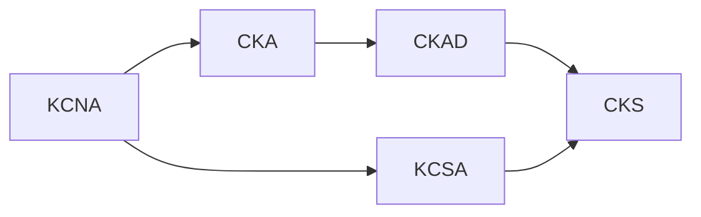

# Kubestronaut

The **[Kubestronaut](https://www.cncf.io/training/kubestronaut/)** program by CNCF recognizes individuals who hold all five core Kubernetes certifications simultaneously. It demonstrates broad and deep expertise across Kubernetes administration, application development, and security.

## Required Certifications

| Certification | Full Name | Type | Duration | Passing Score |
|---|---|---|---|---|
| [KCNA](kcna/index.md) | Kubernetes and Cloud Native Associate | Multiple Choice | 90 min | 75% |
| [KCSA](kcsa/index.md) | Kubernetes and Cloud Native Security Associate | Multiple Choice | 90 min | 75% |
| [CKA](cka/index.md) | Certified Kubernetes Administrator | Performance-based | 2 hours | 66% |
| [CKAD](ckad/index.md) | Certified Kubernetes Application Developer | Performance-based | 2 hours | 66% |
| [CKS](cks/index.md) | Certified Kubernetes Security Specialist | Performance-based | 2 hours | 67% |

## Recommended Order

- **KCNA** and **KCSA** are multiple-choice and cover foundational knowledge — start here
- **CKA** is the prerequisite for CKS and builds core cluster administration skills
- **CKAD** can be taken before or after CKA, as both are independent
- **CKS** requires an active CKA and is widely considered the hardest of the five

!!! tip "All Five Must Be Active"
    All certifications must be **active simultaneously** to qualify as Kubestronaut. Each is valid for 2-3 years. Plan accordingly so earlier certs don't expire while you complete the remaining ones.

## Benefits

- Exclusive Kubestronaut jacket and digital badge
- Discount coupons for recertification
- KubeCon event discounts
- Recognition on the [CNCF Kubestronaut page](https://www.cncf.io/training/kubestronaut/)

## Resources

- [Kubestronaut Program](https://www.cncf.io/training/kubestronaut/)
- [Linux Foundation Training Portal](https://training.linuxfoundation.org/)
- [CNCF Curriculum Repository](https://github.com/cncf/curriculum)
- [killer.sh Exam Simulator](https://killer.sh/) (2 free sessions included with each exam purchase)
