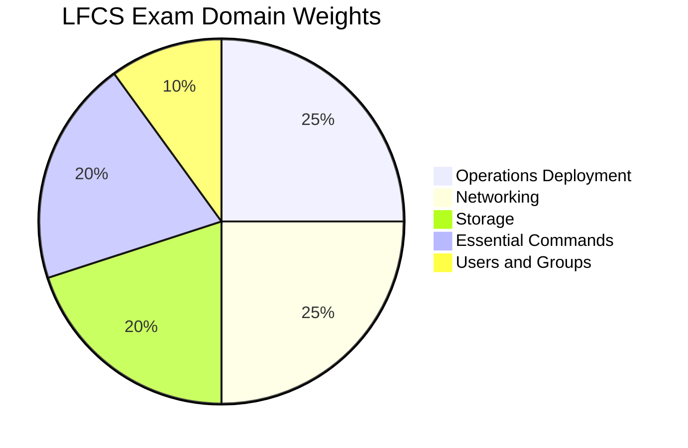

# LFCS - Linux Foundation Certified Sysadmin

The **Linux Foundation Certified Sysadmin (LFCS)** certification validates hands-on skills in Linux system administration. This is a **performance-based exam** covering essential commands, networking, storage, operations deployment, and user management in a live Linux environment.

## Exam Details

| Detail | Value |
|---|---|
| **Format** | Performance-based (hands-on) |
| **Duration** | 120 minutes |
| **Questions** | 17-20 tasks |
| **Passing Score** | 67% |
| **Cost** | $445 |
| **Validity** | 2 years |
| **Prerequisites** | None |
| **Delivery** | Online proctored (PSI Secure Browser) |
| **Environment** | Live Linux command-line environment |

!!! warning "Performance-based Exam"
    The LFCS exam is hands-on. You will work in a real Linux shell completing practical tasks. No multiple-choice questions. The exam is distribution-independent.

## Domain Breakdown

| Domain | Weight |
|---|---|
| Operations Deployment | 25% |
| Networking | 25% |
| Storage | 20% |
| Essential Commands | 20% |
| Users and Groups | 10% |
| **Total** | **100%** |

!!! tip "Exam Tip"
    Operations Deployment (25%) and Networking (25%) together account for 50% of the exam. Master kernel configuration, process management, job scheduling, software packages, and recovery for Operations. For Networking, focus on IPv4/IPv6 configuration, DNS, time sync, SSH, packet filtering, and routing.

## Key Resources

### Official Resources

| Resource | Description |
|---|---|
| [LFCS Certification Page](https://training.linuxfoundation.org/certification/linux-foundation-certified-sysadmin-lfcs/) | Registration, handbook, and exam policies |
| [LFCS Exam Domains](https://docs.linuxfoundation.org/tc-docs/certification/instructions-lfcs-and-lfce) | Detailed domain descriptions |
| [killer.sh](https://killer.sh/) | Official exam simulator (included with purchase) |

### Courses

| Course | Platform |
|---|---|
| Linux Foundation Certified Sysadmin (LFCS) | KodeKloud |
| Linux Essentials for System Administration (LFS201) | Linux Foundation |
| Linux System Administration (LFS301) | Linux Foundation |

### Community Resources

| Resource | Description |
|---|---|
| [Linux Journey](https://linuxjourney.com/) | Free Linux learning resource |
| [TLDR Pages](https://tldr.sh/) | Simplified man pages for quick reference |
