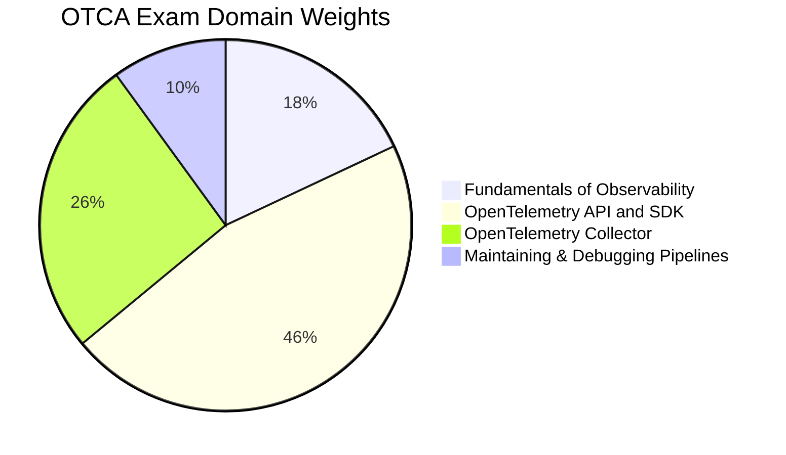

# OTCA - OpenTelemetry Certified Associate

The **OpenTelemetry Certified Associate (OTCA)** certification validates foundational knowledge of observability concepts and the OpenTelemetry framework, including the API, SDK, Collector, and observability pipeline management.

## Exam Details

| Detail | Value |
|---|---|
| **Format** | Multiple Choice |
| **Duration** | 90 minutes |
| **Questions** | 60 |
| **Passing Score** | 75% |
| **Cost** | $250 |
| **Validity** | 2 years |
| **Prerequisites** | None |
| **Delivery** | Online proctored (PSI Secure Browser) |

## Domain Breakdown

| Domain | Weight |
|---|---|
| Fundamentals of Observability | 18% |
| The OpenTelemetry API and SDK | 46% |
| The OpenTelemetry Collector | 26% |
| Maintaining and Debugging Observability Pipelines | 10% |
| **Total** | **100%** |

!!! tip "Exam Tip"
    The OpenTelemetry API and SDK domain accounts for a massive 46% of the exam. Focus on tracing (spans, context propagation), metrics (instruments, temporality, aggregation), logs, SDK pipelines, and sampling strategies. Combined with the Collector (26%), these two domains make up 72% of the exam.

## Key Resources

### Official Resources

| Resource | Description |
|---|---|
| [OTCA Curriculum (PDF)](https://github.com/cncf/curriculum) | Official exam curriculum maintained by CNCF |
| [OTCA Certification Page](https://training.linuxfoundation.org/certification/opentelemetry-certified-associate-otca/) | Registration, handbook, and exam policies |
| [OpenTelemetry Documentation](https://opentelemetry.io/docs/) | Official OpenTelemetry docs |
| [OpenTelemetry Collector Docs](https://opentelemetry.io/docs/collector/) | Collector configuration reference |

### Courses

| Course | Platform |
|---|---|
| OpenTelemetry Certified Associate (OTCA) | KodeKloud |
| Getting Started with OpenTelemetry | OpenTelemetry / CNCF |

### Community Resources

| Resource | Description |
|---|---|
| [OpenTelemetry Blog — OTCA Insights](https://opentelemetry.io/blog/2025/otca-for-newcomers-and-advanced-users/) | Official guidance for exam preparation |
| [OpenTelemetry GitHub](https://github.com/open-telemetry) | Official OpenTelemetry repositories |
