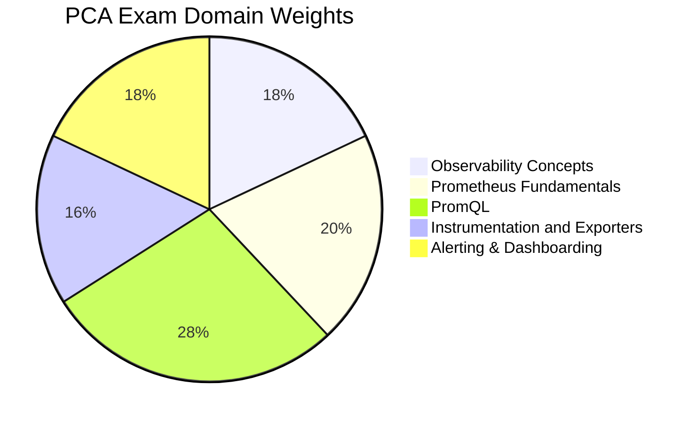

# PCA - Prometheus Certified Associate

The **Prometheus Certified Associate (PCA)** certification validates foundational knowledge of observability and monitoring with Prometheus. It covers PromQL, instrumentation, exporters, alerting, and dashboarding within the Prometheus ecosystem.

## Exam Details

| Detail | Value |
|---|---|
| **Format** | Multiple Choice |
| **Duration** | 90 minutes |
| **Questions** | 60 |
| **Passing Score** | 75% |
| **Cost** | $250 |
| **Validity** | 2 years |
| **Prerequisites** | None |
| **Delivery** | Online proctored (PSI Secure Browser) |

## Domain Breakdown

| Domain | Weight |
|---|---|
| Observability Concepts | 18% |
| Prometheus Fundamentals | 20% |
| PromQL | 28% |
| Instrumentation and Exporters | 16% |
| Alerting & Dashboarding | 18% |
| **Total** | **100%** |

!!! tip "Exam Tip"
    PromQL accounts for 28% of the exam — the largest single domain. Focus on selectors, rates, aggregations, binary operators, and histograms. Combined with Prometheus Fundamentals (20%), these two domains make up almost half the exam.

## Study Progress

- [ ] Observability Concepts (18%)
- [ ] Prometheus Fundamentals (20%)
- [ ] PromQL (28%)
- [ ] Instrumentation and Exporters (16%)
- [ ] Alerting & Dashboarding (18%)
- [ ] Practice questions and mock exams
- [ ] Final review and weak-area revision

## Key Resources

### Official Resources

| Resource | Description |
|---|---|
| [PCA Curriculum (PDF)](https://github.com/cncf/curriculum) | Official exam curriculum maintained by CNCF |
| [PCA Certification Page](https://training.linuxfoundation.org/certification/prometheus-certified-associate/) | Registration, handbook, and exam policies |
| [Prometheus Documentation](https://prometheus.io/docs/) | Official Prometheus docs |
| [PromQL Documentation](https://prometheus.io/docs/prometheus/latest/querying/basics/) | Official PromQL reference |

### Courses

| Course | Platform |
|---|---|
| Prometheus Certified Associate (PCA) | KodeKloud |
| Getting Started with Prometheus | Prometheus / PromLabs |

### Community Resources

| Resource | Description |
|---|---|
| [DevOpsCube PCA Study Guide](https://devopscube.com/prometheus-certified-associate/) | Blog-style study guide |
| [PromLabs PCA Preparation](https://training.promlabs.com/pca-certification/) | Official Prometheus training |
